# V2 Workload Form Mapping Guide - แบบฟอร์มภาระงาน 2/2567

เอกสารนี้จัดทำจากแบบฟอร์มที่แนบมา โดยแคปภาพแต่ละตารางจาก PDF แล้ว map ช่องข้อมูลเข้าสู่ V2 schema baseline ให้ไล่อ่านจากต้นไฟล์ถึงท้ายไฟล์ได้ง่ายที่สุด

## อ้างอิงฐานข้อมูล V2

คู่มือ mapping นี้อ้างอิง schema จริงจาก [`database/migrations/001_base.sql`](../../../database/migrations/001_base.sql) เป็น source of truth สำหรับชื่อตาราง, column, constraint และ index ของ V2 baseline database.

กลุ่มตารางหลักใน migration ที่ใช้กับ mapping นี้:

| กลุ่ม | ตารางที่เกี่ยวข้อง | ใช้กับข้อมูล |
| --- | --- | --- |
| Faculty profile | `faculty`, `faculty_education`, `faculty_interest` | ข้อมูลอาจารย์, วุฒิการศึกษา, ความเชี่ยวชาญ |
| Auth / admin | `app_user`, `app_role`, `app_user_role`, `auth_login_event`, `audit_event` | ผู้ดูแลระบบ, สิทธิ์, login/audit trail |
| Period / master data | `academic_period`, `evaluation_period`, `work_category`, `work_type` | รอบประเมิน, ภาคการศึกษา, หมวดและชนิดงาน |
| Import traceability | `import_batch`, `source_record` | ข้อมูลนำเข้า, raw record, การ trace กลับ source |
| Workload core | `work_item`, `faculty_work_item` | รายการงาน/ผลงาน และผู้รับผิดชอบงาน |
| Workload details | `teaching_detail`, `publication_detail`, `research_project_detail`, `supervision_detail`, `service_detail`, `administration_detail` | รายละเอียดเฉพาะของงานแต่ละประเภท |
| Evidence | `evidence_reference` | ไฟล์/URL/หลักฐานประกอบรายการงาน |

เมื่อคู่มือนี้กล่าวถึง field เช่น `source_weight`, `source_score`, `source_section_code`, `raw_record`, `category_code` หรือ `work_type_code` ให้ยึดชื่อ column และข้อจำกัดจาก migration นี้ก่อนเสมอ.

## หลักการ Mapping กลาง

| หลักการ | ใช้ตาราง/Field |
| --- | --- |
| งาน/ผลงาน 1 รายการ | `work_item` เป็นแกนกลาง |
| อาจารย์คนใดรับผิดชอบงานนั้น | `faculty_work_item` |
| งานสอน | `teaching_detail` |
| Publication/Book/Chapter | `publication_detail` |
| โครงการ/ทุนวิจัย | `research_project_detail` |
| การดูแลนักศึกษา/วิทยานิพนธ์ | `supervision_detail` |
| งานบริการ/กรรมการ/Reviewer/Editor | `service_detail` |
| ตำแหน่งบริหาร | `administration_detail` |
| ไฟล์/URL/หลักฐาน | `evidence_reference` |
| ค่าต้นฉบับ, code ที่ไม่มี field เฉพาะ, กฎ/เพดาน | `source_record.raw_record` |
| รอบประเมิน | `evaluation_period` |
| ภาค/ปีการศึกษา | `academic_period` |

> **สำคัญ:** `source_weight`, `source_score` และ code ต่าง ๆ ในคู่มือนี้ map จากค่าที่อยู่ในแบบฟอร์ม **โดยไม่คำนวณหรือแก้สูตรใหม่**. ค่า code แบบ normalized เช่น `SEMINAR_ADVISOR` เป็นชื่อที่แนะนำสำหรับ V2; ควรเก็บเลข code ต้นฉบับไว้ใน `source_record.raw_record` เสมอเพื่อ trace กลับ source ได้.

> **เพดาน/ยอดรวม:** V2 baseline ยังไม่มี official workload scoring engine ดังนั้นค่าเพดานและยอดรวมควรเป็น derived value หรือเก็บ raw เพื่อ audit ไม่ควรสร้างเป็น `work_item` ปลอม.

## สารบัญ

- ภาพรวมแบบฟอร์มและสรุป 5 หมวด (หน้า 1)
- 1.1 วิชาบรรยาย - ระดับปริญญาตรี (หน้า 2)
- 1.2 วิชาปฏิบัติการ - ระดับปริญญาตรี (หน้า 2)
- 1.3 สัมมนา - ปริญญาตรี (หน้า 2-3)
- 1.4 ซีเนียร์โปรเจกท์หรือปัญหาพิเศษ - ปริญญาตรี (หน้า 3)
- 1.5 สหกิจศึกษา (หน้า 3)
- 1.6 วิชาบรรยาย - ระดับปริญญาโท/เอก (หน้า 3-4)
- 1.7 วิชาปฏิบัติการ - ระดับปริญญาโท/เอก (หน้า 4)
- 1.8 วิชาสัมมนา - ระดับปริญญาโท/เอก (หน้า 4)
- 1.9 วิทยานิพนธ์ในคณะ/มธ. (หน้า 4)
- 1.10 ปัญหาพิเศษในคณะ/มธ. (หน้า 4)
- 1.11 สารนิพนธ์ / ค้นคว้าอิสระ แผน ข. (หน้า 4)
- สรุปหมวด 1 งานสอน (หน้า 5)
- 2.1 รายงานวิจัยฉบับสมบูรณ์ - พิจารณาตามแหล่งทุน (หน้า 6)
- 2.2 รายงานความก้าวหน้าโครงการวิจัยต่อเนื่อง (หน้า 6)
- 2.3.1 วารสาร/Proceedings ระดับนานาชาติ - บทความวิจัย (หน้า 6)
- 2.3.2 Short Communication / บทความวิชาการ / ปริทัศน์ ในฐานข้อมูลสากล (หน้า 7)
- 2.3.3 วารสารวิชาการในฐานข้อมูล TCI (หน้า 7)
- 2.3.4 วารสารนานาชาติอื่น / Proceedings / Data Article (หน้า 7)
- 2.3.5 วารสารระดับชาติอื่น / Proceedings นอก TCI/สกอ. (หน้า 7-8)
- 2.4.1 การนำเสนอผลงานในที่ประชุมระดับนานาชาติ (หน้า 8)
- 2.4.2 การนำเสนอผลงานระดับชาติ/ระดับสถาบัน (หน้า 8)
- 2.5 สิทธิบัตร/อนุสิทธิบัตรในนาม มธ. (หน้า 8-9)
- 2.6.1 หนังสือ/ตำรา และหนังสือ/ตำราแปล (หน้า 9)
- 2.6.2 Book Chapter (หน้า 9)
- 2.7 เอกสารคำสอน/เอกสารประกอบ/คู่มือ/สื่อการสอนนวัตกรรม (หน้า 9-10)
- 2.8.1 ทุนวิจัยภายนอกผ่าน TU-RAC หรือคณะ (หน้า 10)
- 2.8.2 ทุนวิจัยอื่น ๆ (หน้า 10)
- 2.9 รางวัลทางวิชาการในนาม มธ. (หน้า 11)
- 2.10 การนำผลงานวิจัยไปใช้ประโยชน์ (หน้า 11)
- สรุปหมวด 2 งานวิชาการ (หน้า 11)
- 3.1 งานบริหารในตำแหน่ง (หน้า 12)
- 3.2 งานบริหารระดับสาขาวิชา (หน้า 12)
- 3.3 งานบริหารวิชาการ - ผู้ประสานงานประจำวิชา (หน้า 12)
- 3.4 ผู้ประสานงานวิชาฝึกงาน / ฝึกภาคสนาม (หน้า 12-13)
- 3.5 อาจารย์ที่ปรึกษา / PostMaster / PostDoc / Visiting Professor (หน้า 13)
- สรุปหมวด 3 งานบริหาร (หน้า 13)
- 4.1.1 คณะทำงาน/คณะกรรมการระดับคณะหรือสาขา (หน้า 14)
- 4.2.1 คณะกรรมการ/คณะทำงานนอกคณะ ภายใน/นอก มธ. (หน้า 14-15)
- 4.2.2 ตำแหน่งบริหารนอกคณะ ภายใน มธ. (หน้า 15)
- 4.3 งานบริการทางวิชาการแก่สังคม (หน้า 15)
- 4.4 ผู้ประเมินผลงานทางวิชาการ (หน้า 15-16)
- 4.5 ผู้ประเมินตำแหน่งทางวิชาการ (หน้า 16)
- 4.6 Text contribution - Editor (หน้า 16)
- สรุปหมวด 4 งานบริการวิชาการ (หน้า 16)

---

## ภาพรวมแบบฟอร์มและสรุป 5 หมวด

**Source:** หน้า 1

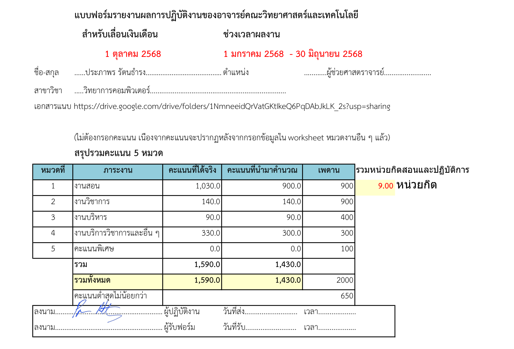

### Mapping

| ข้อมูลในแบบฟอร์ม | ตาราง | Attribute | แนวทาง / ตัวอย่าง |
| --- | --- | --- | --- |
| ชื่อ-สกุล / สาขาวิชา / ตำแหน่ง | `faculty` | `name_th`, `department`, `academic_position` | ข้อมูลหลักอาจารย์ |
| ช่วงเวลาประเมิน | `evaluation_period` | `code`, `label`, `start_date`, `end_date` | ใช้รอบประเมินเป็นตัวหลัก |
| ภาค/ปีการศึกษา (ถ้ามี) | `academic_period` | `academic_year`, `semester`, `label` | เชื่อมกับงานสอน |
| คะแนนจริงรายหมวด | Derived / `source_record` | `raw_record` | เป็นผลรวมจากรายการย่อย ไม่ควร duplicate เป็น base record |
| คะแนนที่นำมาคำนวณหลังเพดาน | Derived / `source_record` | `raw_record` | เก็บค่าต้นฉบับเพื่อ audit; ใน V2 ยังไม่มี scoring engine |
| รวมหน่วยกิตสอน | Derived | `SUM(faculty_work_item.credits)` | คำนวณจากรายการงานสอน |
| ลายเซ็น/การอนุมัติ | `source_record` | `raw_record` | V2 baseline ยังไม่มี approval workflow |

### หมายเหตุ

- ไฟล์นี้มีรายละเอียดหมวด 1-4; หมวด 5 คะแนนพิเศษปรากฏเฉพาะในตารางสรุปหน้า 1 ไม่มีตารางรายละเอียดในไฟล์นี้

---

## 1.1 วิชาบรรยาย - ระดับปริญญาตรี

**Source:** หน้า 2

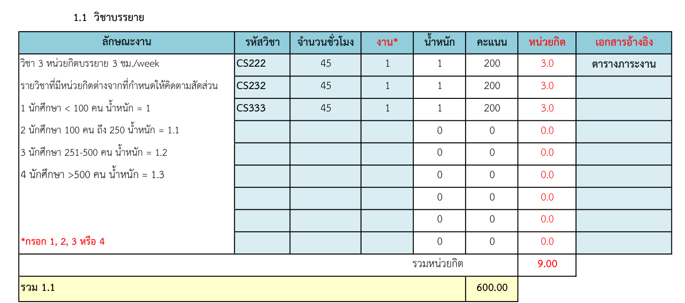

### Mapping

| ข้อมูลในแบบฟอร์ม | ตาราง | Attribute | แนวทาง / ตัวอย่าง |
| --- | --- | --- | --- |
| รหัสวิชา | `teaching_detail` | `course_code` | เช่น CS222 |
| จำนวนชั่วโมง | `teaching_detail` + `faculty_work_item` | `lecture_hours` + `hours` | เช่น 45 |
| งาน* 1-4 | `source_record` | `raw_record.work_code` | รหัสช่วงจำนวนนักศึกษา; เก็บเลขเดิมเพื่อ trace |
| ระดับการศึกษา | `teaching_detail` | `degree_level` | `UNDERGRADUATE` |
| รูปแบบการสอน | `teaching_detail` | `teaching_mode` | `LECTURE` |
| น้ำหนัก | `work_item` | `source_weight` | 1 / 1.1 / 1.2 / 1.3 ตาม source |
| คะแนน | `work_item` | `source_score` | เช่น 200 |
| หน่วยกิต | `teaching_detail` + `faculty_work_item` | `credits` | เช่น 3.00 |
| หมวด | `work_item` | `category_code`, `work_type_code`, `source_section_code` | `TEACHING`, `LECTURE`, `1.1` |
| เอกสารอ้างอิง | `teaching_detail` / `evidence_reference` | `reference_label` / `label`, `s3_key` | ข้อความ label + ไฟล์หลักฐานจริง |

### Mapping code / ชนิด / หน้าที่

| Code | ความหมายจากแบบฟอร์ม | Mapping / น้ำหนัก |
| --- | --- | --- |
| งาน 1 | นักศึกษา < 100 | น้ำหนัก 1.0 |
| งาน 2 | นักศึกษา 100-250 | น้ำหนัก 1.1 |
| งาน 3 | นักศึกษา 251-500 | น้ำหนัก 1.2 |
| งาน 4 | นักศึกษา >500 | น้ำหนัก 1.3 |

### ตัวอย่างจากแบบฟอร์ม

> CS222 | 45 ชั่วโมง | งาน 1 | น้ำหนัก 1 | คะแนน 200 | 3.0 หน่วยกิต | ตารางภาระงาน

---

## 1.2 วิชาปฏิบัติการ - ระดับปริญญาตรี

**Source:** หน้า 2

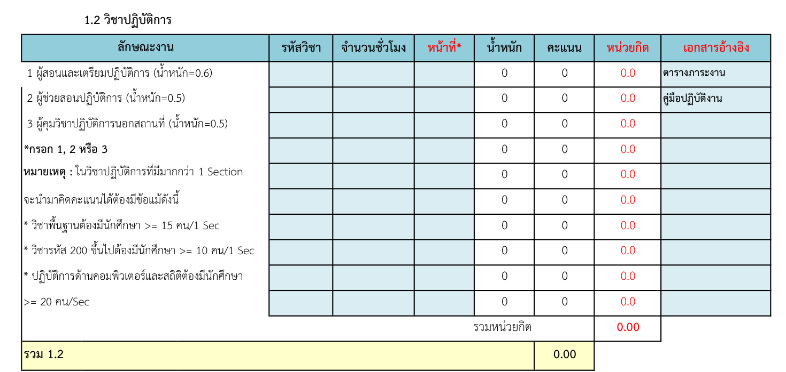

### Mapping

| ข้อมูลในแบบฟอร์ม | ตาราง | Attribute | แนวทาง / ตัวอย่าง |
| --- | --- | --- | --- |
| รหัสวิชา | `teaching_detail` | `course_code` | รหัสรายวิชา |
| จำนวนชั่วโมง | `teaching_detail` + `faculty_work_item` | `lab_hours` + `hours` | ชั่วโมงปฏิบัติการ |
| หน้าที่* | `faculty_work_item` | `role` | `LAB_INSTRUCTOR`, `LAB_ASSISTANT`, `FIELD_LAB_SUPERVISOR` |
| ระดับการศึกษา | `teaching_detail` | `degree_level` | `UNDERGRADUATE` |
| รูปแบบการสอน | `teaching_detail` | `teaching_mode` | `LAB` |
| Section / นักศึกษา | `teaching_detail` | `section_count`, `student_count` | ใช้เมื่อมีข้อมูลจริง |
| น้ำหนัก | `work_item` | `source_weight` | 0.6 หรือ 0.5 |
| คะแนน | `work_item` | `source_score` | ค่าจากฟอร์ม |
| หน่วยกิต | `teaching_detail` + `faculty_work_item` | `credits` | หน่วยกิตของงานสอน |
| หมวด | `work_item` | `category_code`, `work_type_code`, `source_section_code` | `TEACHING`, `LAB`, `1.2` |
| เอกสารอ้างอิง | `teaching_detail` / `evidence_reference` | `reference_label` / evidence fields | ตารางภาระงาน / คู่มือปฏิบัติงาน |

### Mapping code / ชนิด / หน้าที่

| Code | ความหมายจากแบบฟอร์ม | Mapping / น้ำหนัก |
| --- | --- | --- |
| 1 | ผู้สอนและเตรียมปฏิบัติการ | `LAB_INSTRUCTOR`, weight 0.6 |
| 2 | ผู้ช่วยสอนปฏิบัติการ | `LAB_ASSISTANT`, weight 0.5 |
| 3 | ผู้คุมวิชาปฏิบัติการนอกสถานที่ | `FIELD_LAB_SUPERVISOR`, weight 0.5 |

### หมายเหตุ

- เงื่อนไขจำนวนนักศึกษาต่อ Section เป็น rule ของแบบฟอร์ม ให้เก็บใน raw source/rule metadata; V2 baseline ยังไม่คำนวณ scoring rule อัตโนมัติ

---

## 1.3 สัมมนา - ปริญญาตรี

**Source:** หน้า 2-3

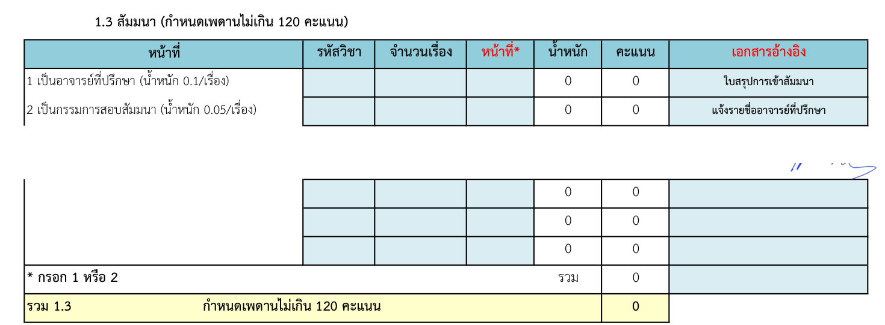

### Mapping

| ข้อมูลในแบบฟอร์ม | ตาราง | Attribute | แนวทาง / ตัวอย่าง |
| --- | --- | --- | --- |
| รหัสวิชา | `teaching_detail` | `course_code` | รหัสวิชาสัมมนา |
| จำนวนเรื่อง | `faculty_work_item` | `quantity` | จำนวนเรื่องที่รับผิดชอบ |
| หน้าที่* | `faculty_work_item` | `role` | `SEMINAR_ADVISOR` / `SEMINAR_EXAM_COMMITTEE` |
| รูปแบบ | `teaching_detail` | `teaching_mode` | `SEMINAR` |
| ระดับ | `teaching_detail` | `degree_level` | `UNDERGRADUATE` |
| น้ำหนัก/เรื่อง | `work_item` | `source_weight` | 0.1 / 0.05 |
| คะแนน | `work_item` | `source_score` | ค่าจากฟอร์ม |
| หมวด | `work_item` | `work_type_code`, `source_section_code` | `SEMINAR`, `1.3` |
| เอกสารอ้างอิง | `teaching_detail` / `evidence_reference` | `reference_label` / evidence fields | ใบสรุปการเข้าสัมมนา / รายชื่ออาจารย์ที่ปรึกษา |

### Mapping code / ชนิด / หน้าที่

| Code | ความหมายจากแบบฟอร์ม | Mapping / น้ำหนัก |
| --- | --- | --- |
| 1 | อาจารย์ที่ปรึกษา | `SEMINAR_ADVISOR`, 0.1/เรื่อง |
| 2 | กรรมการสอบสัมมนา | `SEMINAR_EXAM_COMMITTEE`, 0.05/เรื่อง |

### หมายเหตุ

- เพดาน 120 คะแนนเป็น rule ระดับ section ไม่ใช่ `work_item.source_score`

---

## 1.4 ซีเนียร์โปรเจกท์หรือปัญหาพิเศษ - ปริญญาตรี

**Source:** หน้า 3

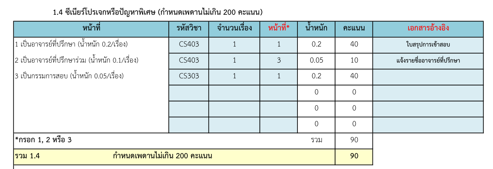

### Mapping

| ข้อมูลในแบบฟอร์ม | ตาราง | Attribute | แนวทาง / ตัวอย่าง |
| --- | --- | --- | --- |
| รหัสวิชา | `supervision_detail` | `course_code` | เช่น CS403 |
| จำนวนเรื่อง | `faculty_work_item` | `quantity` | เช่น 1 |
| หน้าที่* | `faculty_work_item` + `supervision_detail` | `role` + `supervision_role` | Advisor / Co-advisor / Exam committee |
| ประเภทการดูแล | `supervision_detail` | `supervision_type` | `SENIOR_PROJECT` |
| น้ำหนัก | `work_item` | `source_weight` | 0.2 / 0.1 / 0.05 |
| คะแนน | `work_item` | `source_score` | เช่น 40 |
| หมวด | `work_item` | `work_type_code`, `source_section_code` | `SENIOR_PROJECT`, `1.4` |
| หลักฐาน | `evidence_reference` | `label`, `s3_key` | ใบสรุปการเข้าสอบ / รายชื่ออาจารย์ที่ปรึกษา |

### Mapping code / ชนิด / หน้าที่

| Code | ความหมายจากแบบฟอร์ม | Mapping / น้ำหนัก |
| --- | --- | --- |
| 1 | อาจารย์ที่ปรึกษา | `ADVISOR`, 0.2/เรื่อง |
| 2 | อาจารย์ที่ปรึกษาร่วม | `CO_ADVISOR`, 0.1/เรื่อง |
| 3 | กรรมการสอบ | `EXAM_COMMITTEE`, 0.05/เรื่อง |

### ตัวอย่างจากแบบฟอร์ม

> CS403 | 1 เรื่อง | หน้าที่ 1 | น้ำหนัก 0.2 | คะแนน 40 | ใบสรุปการเข้าสอบ

### หมายเหตุ

- เพดาน 200 คะแนนเป็น rule ระดับ section

---

## 1.5 สหกิจศึกษา

**Source:** หน้า 3

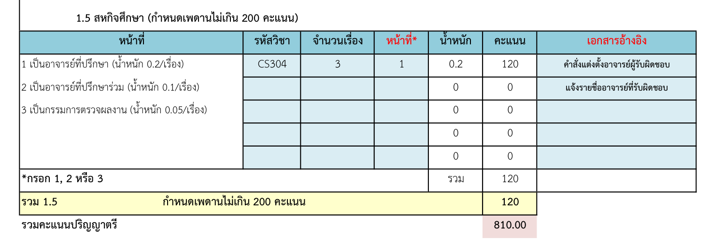

### Mapping

| ข้อมูลในแบบฟอร์ม | ตาราง | Attribute | แนวทาง / ตัวอย่าง |
| --- | --- | --- | --- |
| รหัสวิชา | `supervision_detail` | `course_code` | เช่น CS304 |
| จำนวนเรื่อง | `faculty_work_item` | `quantity` | เช่น 3 |
| หน้าที่* | `faculty_work_item` + `supervision_detail` | `role` + `supervision_role` | Advisor / Co-advisor / Review committee |
| ประเภทการดูแล | `supervision_detail` | `supervision_type` | `COOPERATIVE_EDUCATION` |
| น้ำหนัก | `work_item` | `source_weight` | 0.2 / 0.1 / 0.05 |
| คะแนน | `work_item` | `source_score` | เช่น 120 |
| หมวด | `work_item` | `work_type_code`, `source_section_code` | `COOPERATIVE_EDUCATION`, `1.5` |
| หลักฐาน | `evidence_reference` | `label`, `s3_key` | คำสั่งแต่งตั้ง / แจ้งรายชื่อผู้รับผิดชอบ |

### Mapping code / ชนิด / หน้าที่

| Code | ความหมายจากแบบฟอร์ม | Mapping / น้ำหนัก |
| --- | --- | --- |
| 1 | อาจารย์ที่ปรึกษา | `ADVISOR`, 0.2/เรื่อง |
| 2 | อาจารย์ที่ปรึกษาร่วม | `CO_ADVISOR`, 0.1/เรื่อง |
| 3 | กรรมการตรวจผลงาน | `REVIEW_COMMITTEE`, 0.05/เรื่อง |

### ตัวอย่างจากแบบฟอร์ม

> CS304 | 3 เรื่อง | หน้าที่ 1 | น้ำหนัก 0.2 | คะแนน 120

### หมายเหตุ

- เพดาน 200 คะแนนเป็น rule ระดับ section

---

## 1.6 วิชาบรรยาย - ระดับปริญญาโท/เอก

**Source:** หน้า 3-4

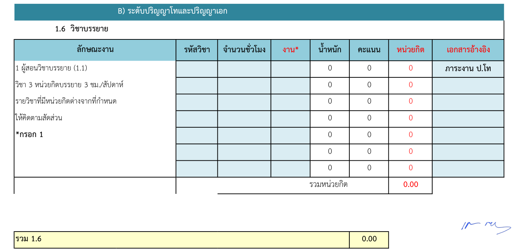

### Mapping

| ข้อมูลในแบบฟอร์ม | ตาราง | Attribute | แนวทาง / ตัวอย่าง |
| --- | --- | --- | --- |
| รหัสวิชา | `teaching_detail` | `course_code` | รหัสวิชา |
| จำนวนชั่วโมง | `teaching_detail` + `faculty_work_item` | `lecture_hours` + `hours` | ชั่วโมงบรรยาย |
| งาน* = 1 | `source_record` | `raw_record.work_code` | เก็บ code ต้นฉบับ; role หลักใช้ `LECTURER` |
| ระดับการศึกษา | `teaching_detail` | `degree_level` | `MASTER` หรือ `DOCTORAL` |
| รูปแบบ | `teaching_detail` | `teaching_mode` | `LECTURE` |
| น้ำหนัก/คะแนน | `work_item` | `source_weight`, `source_score` | ค่าจากฟอร์ม |
| หน่วยกิต | `teaching_detail` + `faculty_work_item` | `credits` | หน่วยกิตวิชา |
| หมวด | `work_item` | `work_type_code`, `source_section_code` | `LECTURE`, `1.6` |
| เอกสารอ้างอิง | `teaching_detail` / `evidence_reference` | `reference_label` / evidence fields | ภาระงาน ป.โท หรือเอกสารจริง |

---

## 1.7 วิชาปฏิบัติการ - ระดับปริญญาโท/เอก

**Source:** หน้า 4

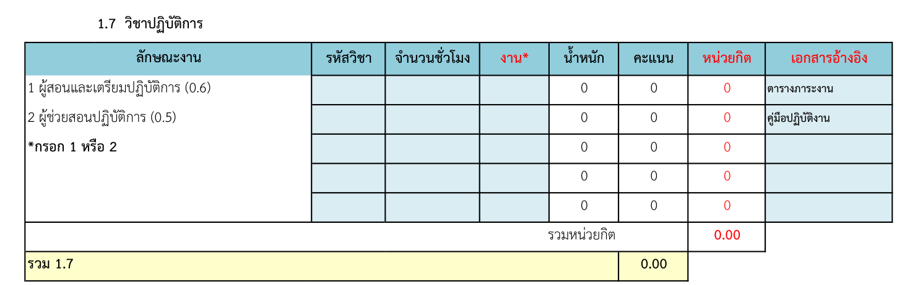

### Mapping

| ข้อมูลในแบบฟอร์ม | ตาราง | Attribute | แนวทาง / ตัวอย่าง |
| --- | --- | --- | --- |
| รหัสวิชา | `teaching_detail` | `course_code` | รหัสวิชา |
| จำนวนชั่วโมง | `teaching_detail` + `faculty_work_item` | `lab_hours` + `hours` | ชั่วโมงปฏิบัติการ |
| งาน* | `faculty_work_item` | `role` | `LAB_INSTRUCTOR` / `LAB_ASSISTANT` |
| ระดับ | `teaching_detail` | `degree_level` | `MASTER` / `DOCTORAL` |
| รูปแบบ | `teaching_detail` | `teaching_mode` | `LAB` |
| น้ำหนัก | `work_item` | `source_weight` | 0.6 / 0.5 |
| คะแนน | `work_item` | `source_score` | ค่าจากฟอร์ม |
| หน่วยกิต | `teaching_detail` + `faculty_work_item` | `credits` | ค่าจากฟอร์ม |
| หมวด | `work_item` | `work_type_code`, `source_section_code` | `LAB`, `1.7` |
| หลักฐาน | `evidence_reference` | `label`, `s3_key` | ตารางภาระงาน / คู่มือปฏิบัติงาน |

### Mapping code / ชนิด / หน้าที่

| Code | ความหมายจากแบบฟอร์ม | Mapping / น้ำหนัก |
| --- | --- | --- |
| 1 | ผู้สอนและเตรียมปฏิบัติการ | `LAB_INSTRUCTOR`, 0.6 |
| 2 | ผู้ช่วยสอนปฏิบัติการ | `LAB_ASSISTANT`, 0.5 |

---

## 1.8 วิชาสัมมนา - ระดับปริญญาโท/เอก

**Source:** หน้า 4

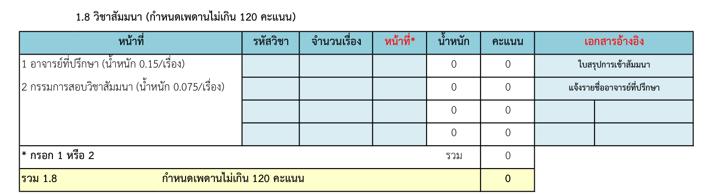

### Mapping

| ข้อมูลในแบบฟอร์ม | ตาราง | Attribute | แนวทาง / ตัวอย่าง |
| --- | --- | --- | --- |
| รหัสวิชา | `teaching_detail` | `course_code` | รหัสวิชาสัมมนา |
| จำนวนเรื่อง | `faculty_work_item` | `quantity` | จำนวนเรื่อง |
| หน้าที่* | `faculty_work_item` | `role` | `SEMINAR_ADVISOR` / `SEMINAR_EXAM_COMMITTEE` |
| ระดับ | `teaching_detail` | `degree_level` | `MASTER` / `DOCTORAL` |
| รูปแบบ | `teaching_detail` | `teaching_mode` | `SEMINAR` |
| น้ำหนัก | `work_item` | `source_weight` | 0.15 / 0.075 ต่อเรื่อง |
| คะแนน | `work_item` | `source_score` | ค่าจากฟอร์ม |
| หมวด | `work_item` | `work_type_code`, `source_section_code` | `SEMINAR`, `1.8` |
| หลักฐาน | `evidence_reference` | `label`, `s3_key` | ใบสรุปการเข้าสัมมนา / รายชื่ออาจารย์ที่ปรึกษา |

### Mapping code / ชนิด / หน้าที่

| Code | ความหมายจากแบบฟอร์ม | Mapping / น้ำหนัก |
| --- | --- | --- |
| 1 | อาจารย์ที่ปรึกษา | `SEMINAR_ADVISOR`, 0.15/เรื่อง |
| 2 | กรรมการสอบวิชาสัมมนา | `SEMINAR_EXAM_COMMITTEE`, 0.075/เรื่อง |

### หมายเหตุ

- เพดาน 120 คะแนนเป็น rule ระดับ section

---

## 1.9 วิทยานิพนธ์ในคณะ/มธ.

**Source:** หน้า 4

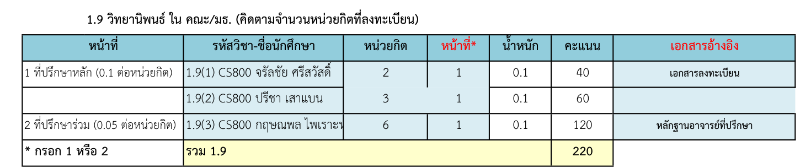

### Mapping

| ข้อมูลในแบบฟอร์ม | ตาราง | Attribute | แนวทาง / ตัวอย่าง |
| --- | --- | --- | --- |
| รหัสวิชา | `supervision_detail` | `course_code` | เช่น CS800 |
| ชื่อนักศึกษา | `source_record` | `raw_record` | เก็บใน source ที่จำกัดสิทธิ์; V2 ไม่เปิดเผย student identity |
| หน่วยกิตลงทะเบียน | `supervision_detail` + `faculty_work_item` | `credits` | 2 / 3 / 6 ฯลฯ |
| หน้าที่* | `faculty_work_item` + `supervision_detail` | `role` + `supervision_role` | `MAIN_ADVISOR` / `CO_ADVISOR` |
| ประเภทการดูแล | `supervision_detail` | `supervision_type` | `THESIS` |
| จำนวนผู้เรียน | `supervision_detail` | `student_count` | ปกติ 1 ต่อ record |
| นโยบาย identity | `supervision_detail` | `student_identifier_policy` | `REDACTED` |
| น้ำหนัก/คะแนน | `work_item` | `source_weight`, `source_score` | ตามจำนวนหน่วยกิต |
| หมวด | `work_item` | `work_type_code`, `source_section_code` | `THESIS_SUPERVISION`, `1.9` |
| หลักฐาน | `evidence_reference` | `label`, `s3_key` | เอกสารลงทะเบียน / หลักฐานอาจารย์ที่ปรึกษา |

### Mapping code / ชนิด / หน้าที่

| Code | ความหมายจากแบบฟอร์ม | Mapping / น้ำหนัก |
| --- | --- | --- |
| 1 | ที่ปรึกษาหลัก | `MAIN_ADVISOR`, 0.1/หน่วยกิต |
| 2 | ที่ปรึกษาร่วม | `CO_ADVISOR`, 0.05/หน่วยกิต |

### ตัวอย่างจากแบบฟอร์ม

> CS800 | 2 หน่วยกิต | หน้าที่ 1 | น้ำหนัก 0.1 | คะแนน 40 | เอกสารลงทะเบียน

### หมายเหตุ

- ใน source มีแถวภายใต้คำอธิบาย “ที่ปรึกษาร่วม” แต่ค่าที่กรอกเป็นหน้าที่ 1 / น้ำหนัก 0.1; ให้ preserve ค่า source และ flag validation warning แทนการแก้อัตโนมัติ

---

## 1.10 ปัญหาพิเศษในคณะ/มธ.

**Source:** หน้า 4

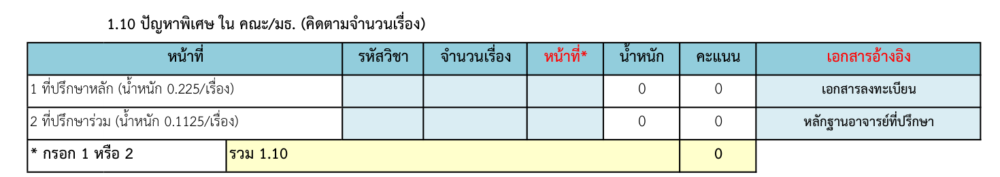

### Mapping

| ข้อมูลในแบบฟอร์ม | ตาราง | Attribute | แนวทาง / ตัวอย่าง |
| --- | --- | --- | --- |
| รหัสวิชา | `supervision_detail` | `course_code` | รหัสวิชา |
| จำนวนเรื่อง | `faculty_work_item` | `quantity` | ตัวฐานคำนวณของ section นี้ |
| หน้าที่* | `faculty_work_item` + `supervision_detail` | `role` + `supervision_role` | Main/Co advisor |
| ประเภท | `supervision_detail` | `supervision_type` | `SPECIAL_PROBLEM` |
| น้ำหนัก | `work_item` | `source_weight` | 0.225 / 0.1125 ต่อเรื่อง |
| คะแนน | `work_item` | `source_score` | ค่าจากฟอร์ม |
| หมวด | `work_item` | `work_type_code`, `source_section_code` | `SPECIAL_PROBLEM_SUPERVISION`, `1.10` |
| หลักฐาน | `evidence_reference` | `label`, `s3_key` | เอกสารลงทะเบียน / หลักฐานที่ปรึกษา |

### Mapping code / ชนิด / หน้าที่

| Code | ความหมายจากแบบฟอร์ม | Mapping / น้ำหนัก |
| --- | --- | --- |
| 1 | ที่ปรึกษาหลัก | `MAIN_ADVISOR`, 0.225/เรื่อง |
| 2 | ที่ปรึกษาร่วม | `CO_ADVISOR`, 0.1125/เรื่อง |

---

## 1.11 สารนิพนธ์ / ค้นคว้าอิสระ แผน ข.

**Source:** หน้า 4

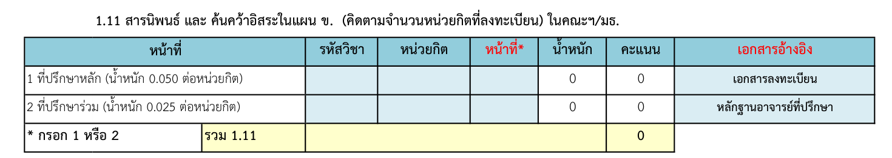

### Mapping

| ข้อมูลในแบบฟอร์ม | ตาราง | Attribute | แนวทาง / ตัวอย่าง |
| --- | --- | --- | --- |
| รหัสวิชา | `supervision_detail` | `course_code` | รหัสวิชา |
| หน่วยกิต | `supervision_detail` + `faculty_work_item` | `credits` | ตัวฐานคำนวณของ section นี้ |
| หน้าที่* | `faculty_work_item` + `supervision_detail` | `role` + `supervision_role` | Main/Co advisor |
| ประเภท | `supervision_detail` | `supervision_type` | `INDEPENDENT_STUDY` หรือ `THEMATIC_PAPER` |
| น้ำหนัก | `work_item` | `source_weight` | 0.050 / 0.025 ต่อหน่วยกิต |
| คะแนน | `work_item` | `source_score` | ค่าจากฟอร์ม |
| หมวด | `work_item` | `work_type_code`, `source_section_code` | `INDEPENDENT_STUDY_SUPERVISION`, `1.11` |
| หลักฐาน | `evidence_reference` | `label`, `s3_key` | เอกสารลงทะเบียน / หลักฐานที่ปรึกษา |

### Mapping code / ชนิด / หน้าที่

| Code | ความหมายจากแบบฟอร์ม | Mapping / น้ำหนัก |
| --- | --- | --- |
| 1 | ที่ปรึกษาหลัก | `MAIN_ADVISOR`, 0.050/หน่วยกิต |
| 2 | ที่ปรึกษาร่วม | `CO_ADVISOR`, 0.025/หน่วยกิต |

---

## สรุปหมวด 1 งานสอน

**Source:** หน้า 5

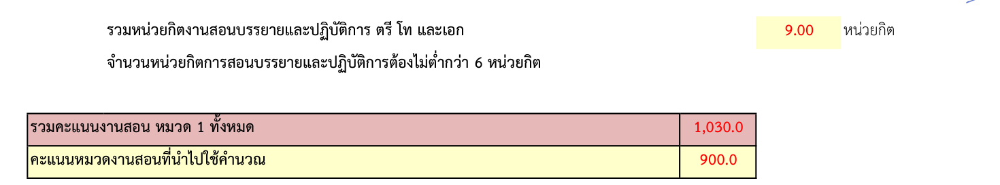

### Mapping

| ข้อมูลในแบบฟอร์ม | ตาราง | Attribute | แนวทาง / ตัวอย่าง |
| --- | --- | --- | --- |
| รวมหน่วยกิตบรรยาย/ปฏิบัติ ตรี-โท-เอก | Derived | `SUM(faculty_work_item.credits)` | ใน source = 9.00 |
| เงื่อนไขขั้นต่ำ 6 หน่วยกิต | `source_record` / rule metadata | `raw_record` | ไม่ใช่ base work item |
| รวมคะแนนจริงหมวด 1 | Derived | `SUM(work_item.source_score)` | ใน source = 1,030.0 |
| คะแนนหลังเพดาน | Derived / raw audit | future scoring rule / `raw_record` | ใน source = 900.0 |

---

## 2.1 รายงานวิจัยฉบับสมบูรณ์ - พิจารณาตามแหล่งทุน

**Source:** หน้า 6

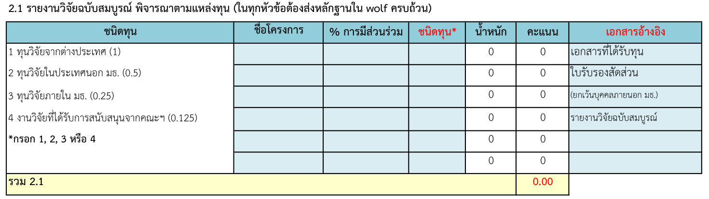

### Mapping

| ข้อมูลในแบบฟอร์ม | ตาราง | Attribute | แนวทาง / ตัวอย่าง |
| --- | --- | --- | --- |
| ชื่อโครงการ | `research_project_detail` + `work_item` | `project_title` + `title` | ชื่อโครงการวิจัย |
| % การมีส่วนร่วม | `faculty_work_item` | `contribution_percent` | เช่น 60.00 |
| ชนิดทุน* | `research_project_detail` | `funding_type` | normalize จาก code 1-4 |
| แหล่งทุน | `research_project_detail` | `funding_source` | ชื่อหน่วยงานถ้ามี |
| สถานะ | `research_project_detail` | `project_status` | ใช้ `COMPLETED` เมื่อ source รองรับ |
| น้ำหนัก/คะแนน | `work_item` | `source_weight`, `source_score` | ค่าจากฟอร์ม |
| หมวด | `work_item` | `category_code`, `work_type_code`, `source_section_code` | `RESEARCH`, `RESEARCH_PROJECT`, `2.1` |
| หลักฐาน | `evidence_reference` | `label`, `s3_key` | เอกสารได้รับทุน / ใบรับรองสัดส่วน / รายงานฉบับสมบูรณ์ |

### Mapping code / ชนิด / หน้าที่

| Code | ความหมายจากแบบฟอร์ม | Mapping / น้ำหนัก |
| --- | --- | --- |
| 1 | ทุนวิจัยจากต่างประเทศ | `FOREIGN_GRANT`, weight 1.0 |
| 2 | ทุนวิจัยในประเทศนอก มธ. | `DOMESTIC_EXTERNAL_GRANT`, weight 0.5 |
| 3 | ทุนวิจัยภายใน มธ. | `UNIVERSITY_INTERNAL_GRANT`, weight 0.25 |
| 4 | งานวิจัยสนับสนุนจากคณะ | `FACULTY_GRANT`, weight 0.125 |

---

## 2.2 รายงานความก้าวหน้าโครงการวิจัยต่อเนื่อง

**Source:** หน้า 6

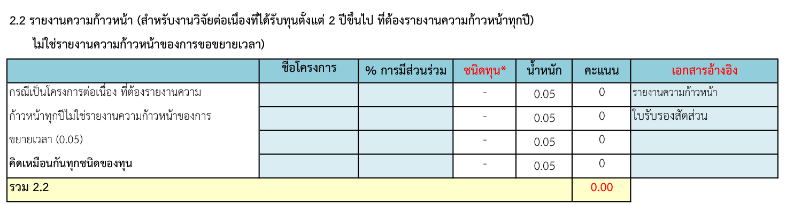

### Mapping

| ข้อมูลในแบบฟอร์ม | ตาราง | Attribute | แนวทาง / ตัวอย่าง |
| --- | --- | --- | --- |
| ชื่อโครงการ | `research_project_detail` + `work_item` | `project_title` + `title` | สร้าง work item ของรายงานความก้าวหน้า |
| % การมีส่วนร่วม | `faculty_work_item` | `contribution_percent` | ตามหลักฐานสัดส่วน |
| ชนิดทุน | `research_project_detail` / `source_record` | `funding_type` / `raw_record` | ถ้ามี code ต้นทาง |
| น้ำหนัก | `work_item` | `source_weight` | 0.05 ตาม source |
| คะแนน | `work_item` | `source_score` | ค่าจากฟอร์ม |
| หมวด | `work_item` | `work_type_code`, `source_section_code` | `RESEARCH_PROGRESS_REPORT`, `2.2` |
| หลักฐาน | `evidence_reference` | `label`, `s3_key` | รายงานความก้าวหน้า / ใบรับรองสัดส่วน |

### หมายเหตุ

- แบบฟอร์มระบุว่าใช้กับโครงการต่อเนื่องตั้งแต่ 2 ปีขึ้นไปและไม่ใช่รายงานขอขยายเวลา; เก็บเงื่อนไขนี้ใน raw rule metadata

---

## 2.3.1 วารสาร/Proceedings ระดับนานาชาติ - บทความวิจัย

**Source:** หน้า 6

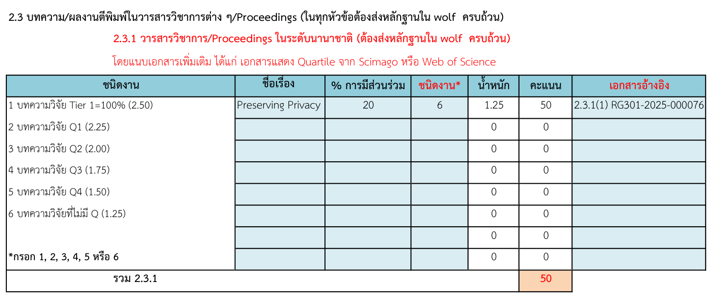

### Mapping

| ข้อมูลในแบบฟอร์ม | ตาราง | Attribute | แนวทาง / ตัวอย่าง |
| --- | --- | --- | --- |
| ชื่อเรื่อง | `publication_detail` + `work_item` | `publication_title` + `title` | ชื่อบทความ |
| % การมีส่วนร่วม | `faculty_work_item` | `contribution_percent` | เช่น 20.00 |
| ชนิดงาน* | `publication_detail` | `publication_kind`, `quartile` | Research article + Tier/Q |
| ฐานข้อมูล | `publication_detail` | `indexing_database` | Scopus/WoS/Scimago เมื่อหลักฐานระบุ |
| venue / ปี / DOI | `publication_detail` | `venue`, `publication_year`, `doi` | เก็บเมื่อมีข้อมูล |
| น้ำหนัก/คะแนน | `work_item` | `source_weight`, `source_score` | ตามชนิดงานและสัดส่วน |
| หมวด | `work_item` | `work_type_code`, `source_section_code` | `PUBLICATION`, `2.3.1` |
| หลักฐาน | `evidence_reference` | `label`, `external_url`, `s3_key` | Quartile + publication evidence |

### Mapping code / ชนิด / หน้าที่

| Code | ความหมายจากแบบฟอร์ม | Mapping / น้ำหนัก |
| --- | --- | --- |
| 1 | Research article Tier 1=100% | `TIER1`, 2.50 |
| 2 | Research article Q1 | `Q1`, 2.25 |
| 3 | Research article Q2 | `Q2`, 2.00 |
| 4 | Research article Q3 | `Q3`, 1.75 |
| 5 | Research article Q4 | `Q4`, 1.50 |
| 6 | Research article ไม่มี Q | `NO_Q`, 1.25 |

### ตัวอย่างจากแบบฟอร์ม

> Preserving Privacy | contribution 20% | ชนิดงาน 6 | น้ำหนัก 1.25 | คะแนน 50 | RG301-2025-000076

---

## 2.3.2 Short Communication / บทความวิชาการ / ปริทัศน์ ในฐานข้อมูลสากล

**Source:** หน้า 7

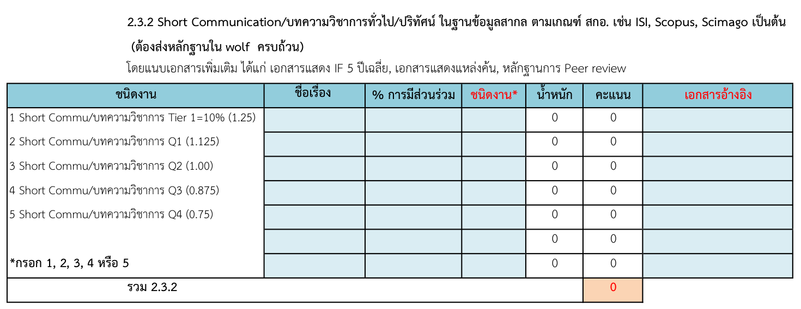

### Mapping

| ข้อมูลในแบบฟอร์ม | ตาราง | Attribute | แนวทาง / ตัวอย่าง |
| --- | --- | --- | --- |
| ชื่อเรื่อง | `publication_detail` + `work_item` | `publication_title` + `title` | ชื่อผลงาน |
| % การมีส่วนร่วม | `faculty_work_item` | `contribution_percent` | เปอร์เซ็นต์ผู้รับผิดชอบ |
| ชนิดงาน* | `publication_detail` | `publication_kind`, `quartile` | Short communication / academic/review + Tier/Q |
| ฐานข้อมูล | `publication_detail` | `indexing_database` | ISI / Scopus / Scimago ฯลฯ |
| น้ำหนัก/คะแนน | `work_item` | `source_weight`, `source_score` | ตาม source |
| หมวด | `work_item` | `work_type_code`, `source_section_code` | `PUBLICATION`, `2.3.2` |
| หลักฐาน | `evidence_reference` | `label`, `s3_key` | IF เฉลี่ย 5 ปี / แหล่งค้น / peer review |

### Mapping code / ชนิด / หน้าที่

| Code | ความหมายจากแบบฟอร์ม | Mapping / น้ำหนัก |
| --- | --- | --- |
| 1 | Tier 1=10% | 1.25 |
| 2 | Q1 | 1.125 |
| 3 | Q2 | 1.00 |
| 4 | Q3 | 0.875 |
| 5 | Q4 | 0.75 |

---

## 2.3.3 วารสารวิชาการในฐานข้อมูล TCI

**Source:** หน้า 7

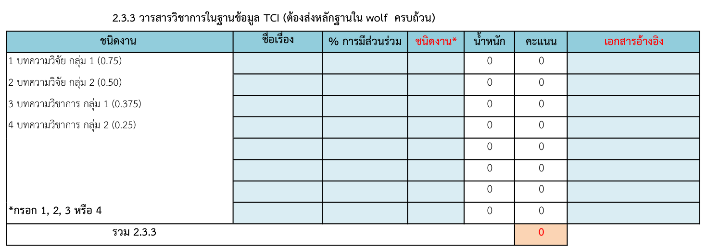

### Mapping

| ข้อมูลในแบบฟอร์ม | ตาราง | Attribute | แนวทาง / ตัวอย่าง |
| --- | --- | --- | --- |
| ชื่อเรื่อง | `publication_detail` + `work_item` | `publication_title` + `title` | ชื่อผลงาน |
| % การมีส่วนร่วม | `faculty_work_item` | `contribution_percent` | เปอร์เซ็นต์ |
| ชนิดงาน* | `publication_detail` | `publication_kind`, `quartile` | ใช้ `quartile` เป็น tier/group เช่น `TCI_GROUP_1` |
| ฐานข้อมูล | `publication_detail` | `indexing_database` | `TCI` |
| น้ำหนัก/คะแนน | `work_item` | `source_weight`, `source_score` | ตาม source |
| หมวด | `work_item` | `work_type_code`, `source_section_code` | `PUBLICATION`, `2.3.3` |
| หลักฐาน | `evidence_reference` | `label`, `s3_key` | หลักฐาน TCI / บทความ |

### Mapping code / ชนิด / หน้าที่

| Code | ความหมายจากแบบฟอร์ม | Mapping / น้ำหนัก |
| --- | --- | --- |
| 1 | บทความวิจัย กลุ่ม 1 | 0.75 |
| 2 | บทความวิจัย กลุ่ม 2 | 0.50 |
| 3 | บทความวิชาการ กลุ่ม 1 | 0.375 |
| 4 | บทความวิชาการ กลุ่ม 2 | 0.25 |

---

## 2.3.4 วารสารนานาชาติอื่น / Proceedings / Data Article

**Source:** หน้า 7

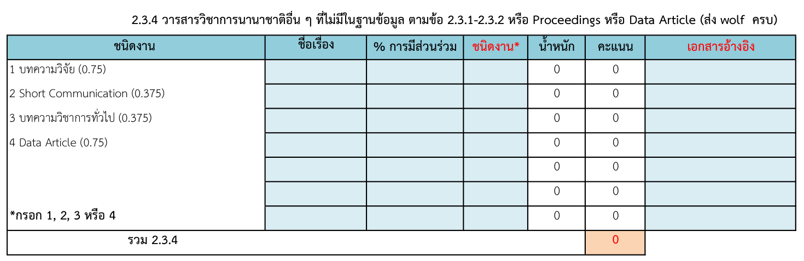

### Mapping

| ข้อมูลในแบบฟอร์ม | ตาราง | Attribute | แนวทาง / ตัวอย่าง |
| --- | --- | --- | --- |
| ชื่อเรื่อง | `publication_detail` + `work_item` | `publication_title` + `title` | ชื่อผลงาน |
| % การมีส่วนร่วม | `faculty_work_item` | `contribution_percent` | เปอร์เซ็นต์ |
| ชนิดงาน* | `publication_detail` | `publication_kind` | Research / Short Communication / Academic Article / Data Article |
| ฐานข้อมูล/venue | `publication_detail` | `indexing_database`, `venue` | เมื่อ source มีข้อมูล |
| น้ำหนัก/คะแนน | `work_item` | `source_weight`, `source_score` | ตาม source |
| หมวด | `work_item` | `work_type_code`, `source_section_code` | `PUBLICATION`, `2.3.4` |
| หลักฐาน | `evidence_reference` | `label`, `s3_key` | publication evidence |

### Mapping code / ชนิด / หน้าที่

| Code | ความหมายจากแบบฟอร์ม | Mapping / น้ำหนัก |
| --- | --- | --- |
| 1 | บทความวิจัย | 0.75 |
| 2 | Short Communication | 0.375 |
| 3 | บทความวิชาการทั่วไป | 0.375 |
| 4 | Data Article | 0.75 |

---

## 2.3.5 วารสารระดับชาติอื่น / Proceedings นอก TCI/สกอ.

**Source:** หน้า 7-8

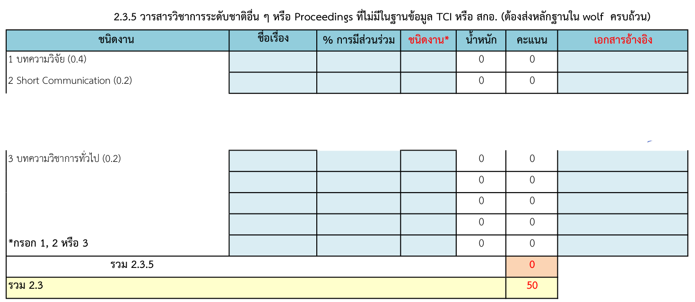

### Mapping

| ข้อมูลในแบบฟอร์ม | ตาราง | Attribute | แนวทาง / ตัวอย่าง |
| --- | --- | --- | --- |
| ชื่อเรื่อง | `publication_detail` + `work_item` | `publication_title` + `title` | ชื่อผลงาน |
| % การมีส่วนร่วม | `faculty_work_item` | `contribution_percent` | เปอร์เซ็นต์ |
| ชนิดงาน* | `publication_detail` | `publication_kind` | Research / Short Communication / Academic Article |
| น้ำหนัก/คะแนน | `work_item` | `source_weight`, `source_score` | ตาม source |
| หมวด | `work_item` | `work_type_code`, `source_section_code` | `PUBLICATION`, `2.3.5` |
| หลักฐาน | `evidence_reference` | `label`, `s3_key` | หลักฐาน publication |

### Mapping code / ชนิด / หน้าที่

| Code | ความหมายจากแบบฟอร์ม | Mapping / น้ำหนัก |
| --- | --- | --- |
| 1 | บทความวิจัย | 0.4 |
| 2 | Short Communication | 0.2 |
| 3 | บทความวิชาการทั่วไป | 0.2 |

---

## 2.4.1 การนำเสนอผลงานในที่ประชุมระดับนานาชาติ

**Source:** หน้า 8

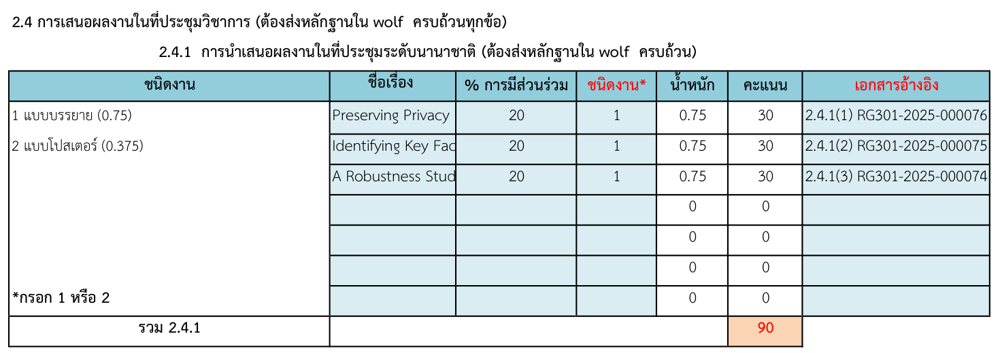

### Mapping

| ข้อมูลในแบบฟอร์ม | ตาราง | Attribute | แนวทาง / ตัวอย่าง |
| --- | --- | --- | --- |
| ชื่อเรื่อง | `work_item` | `title` | ชื่อผลงานที่นำเสนอ |
| % การมีส่วนร่วม | `faculty_work_item` | `contribution_percent` | เปอร์เซ็นต์ |
| ชนิดงาน* | `source_record` | `raw_record.presentation_mode` | Oral / Poster; ปัจจุบันไม่มี presentation_detail |
| น้ำหนัก/คะแนน | `work_item` | `source_weight`, `source_score` | 0.75 / 0.375 ตามชนิด |
| หมวด | `work_item` | `category_code`, `work_type_code`, `source_section_code` | `RESEARCH`, `CONFERENCE_PRESENTATION`, `2.4.1` |
| หลักฐาน | `evidence_reference` | `label`, `s3_key` | หลักฐานการนำเสนอ |

### Mapping code / ชนิด / หน้าที่

| Code | ความหมายจากแบบฟอร์ม | Mapping / น้ำหนัก |
| --- | --- | --- |
| 1 | แบบบรรยาย (Oral) | 0.75 |
| 2 | แบบโปสเตอร์ (Poster) | 0.375 |

### ตัวอย่างจากแบบฟอร์ม

> Preserving Privacy | contribution 20% | ชนิด 1 | น้ำหนัก 0.75 | คะแนน 30 | RG301-2025-000076

---

## 2.4.2 การนำเสนอผลงานระดับชาติ/ระดับสถาบัน

**Source:** หน้า 8

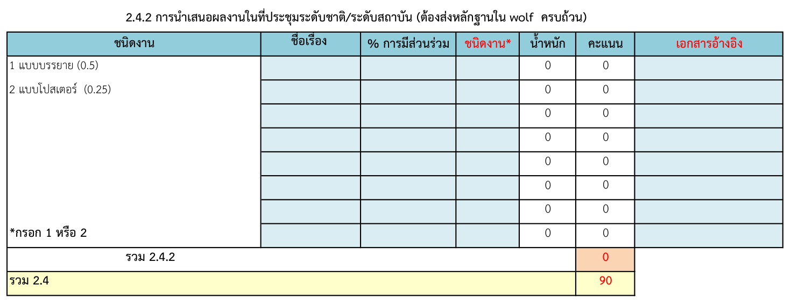

### Mapping

| ข้อมูลในแบบฟอร์ม | ตาราง | Attribute | แนวทาง / ตัวอย่าง |
| --- | --- | --- | --- |
| ชื่อเรื่อง | `work_item` | `title` | ชื่อผลงาน |
| % การมีส่วนร่วม | `faculty_work_item` | `contribution_percent` | เปอร์เซ็นต์ |
| ชนิดงาน* | `source_record` | `raw_record.presentation_mode` | Oral / Poster |
| น้ำหนัก/คะแนน | `work_item` | `source_weight`, `source_score` | 0.5 / 0.25 |
| หมวด | `work_item` | `work_type_code`, `source_section_code` | `CONFERENCE_PRESENTATION`, `2.4.2` |
| หลักฐาน | `evidence_reference` | `label`, `s3_key` | หลักฐานการนำเสนอ |

### Mapping code / ชนิด / หน้าที่

| Code | ความหมายจากแบบฟอร์ม | Mapping / น้ำหนัก |
| --- | --- | --- |
| 1 | แบบบรรยาย | 0.5 |
| 2 | แบบโปสเตอร์ | 0.25 |

---

## 2.5 สิทธิบัตร/อนุสิทธิบัตรในนาม มธ.

**Source:** หน้า 8-9

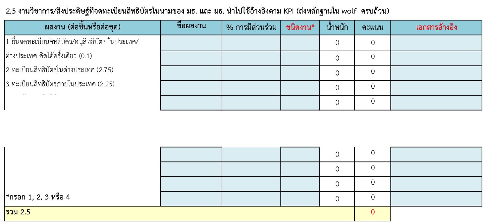

### Mapping

| ข้อมูลในแบบฟอร์ม | ตาราง | Attribute | แนวทาง / ตัวอย่าง |
| --- | --- | --- | --- |
| ชื่อผลงาน | `work_item` | `title` | ชื่อสิ่งประดิษฐ์/สิทธิบัตร |
| % การมีส่วนร่วม | `faculty_work_item` | `contribution_percent` | เปอร์เซ็นต์ |
| ชนิดงาน* | `source_record` | `raw_record.ip_type_code` | เก็บ numeric code ต้นฉบับ |
| ประเภทงาน normalized | `work_item` | `work_type_code` | `PATENT_OR_UTILITY_MODEL` |
| น้ำหนัก/คะแนน | `work_item` | `source_weight`, `source_score` | ตาม source |
| หมวด | `work_item` | `source_section_code` | `2.5` |
| หลักฐาน | `evidence_reference` | `label`, `s3_key`, `external_url` | ทะเบียน/คำขอ/หลักฐาน KPI |

### Mapping code / ชนิด / หน้าที่

| Code | ความหมายจากแบบฟอร์ม | Mapping / น้ำหนัก |
| --- | --- | --- |
| 1 | ยื่นจดทะเบียนสิทธิบัตร/อนุสิทธิบัตร ใน/ต่างประเทศ คิดครั้งเดียว | 0.1 |
| 2 | ทะเบียนสิทธิบัตรต่างประเทศ | 2.75 |
| 3 | ทะเบียนสิทธิบัตรภายในประเทศ | 2.25 |
| 4 | มี code 4 ในฟอร์ม แต่ข้อความชนิดงานไม่ปรากฏชัดใน PDF ที่ให้ | เก็บ code 4 ใน raw source; ไม่เดาความหมาย |

---

## 2.6.1 หนังสือ/ตำรา และหนังสือ/ตำราแปล

**Source:** หน้า 9

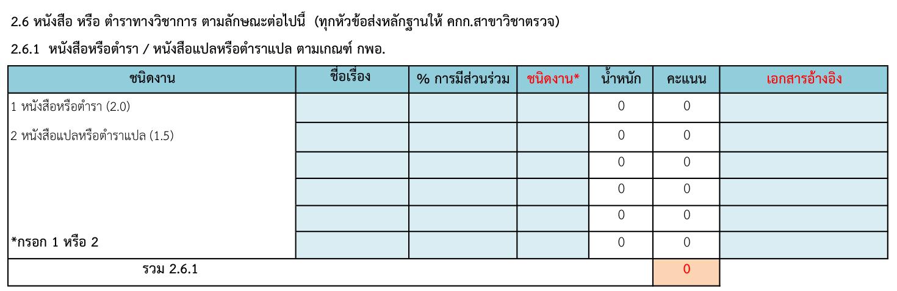

### Mapping

| ข้อมูลในแบบฟอร์ม | ตาราง | Attribute | แนวทาง / ตัวอย่าง |
| --- | --- | --- | --- |
| ชื่อเรื่อง | `publication_detail` + `work_item` | `publication_title` + `title` | ชื่อหนังสือ/ตำรา |
| % การมีส่วนร่วม | `faculty_work_item` | `contribution_percent` | เปอร์เซ็นต์ |
| ชนิดงาน* | `publication_detail` | `publication_kind` | `BOOK_OR_TEXTBOOK` / `TRANSLATED_BOOK_OR_TEXTBOOK` |
| สำนักพิมพ์/ISBN/ปี | `publication_detail` | `publisher`, `isbn`, `publication_year` | เมื่อมีข้อมูล |
| น้ำหนัก/คะแนน | `work_item` | `source_weight`, `source_score` | 2.0 / 1.5 ตามชนิด |
| หมวด | `work_item` | `work_type_code`, `source_section_code` | `BOOK`, `2.6.1` |
| หลักฐาน | `evidence_reference` | `label`, `s3_key` | หลักฐานตามเกณฑ์ กพอ. |

### Mapping code / ชนิด / หน้าที่

| Code | ความหมายจากแบบฟอร์ม | Mapping / น้ำหนัก |
| --- | --- | --- |
| 1 | หนังสือหรือตำรา | 2.0 |
| 2 | หนังสือแปลหรือตำราแปล | 1.5 |

---

## 2.6.2 Book Chapter

**Source:** หน้า 9

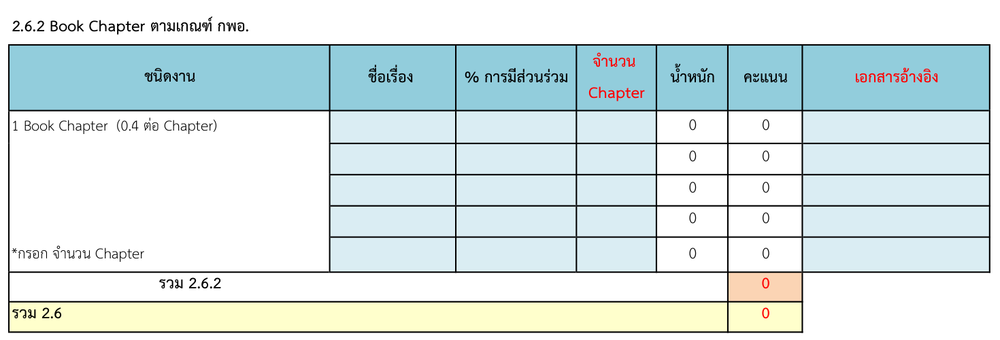

### Mapping

| ข้อมูลในแบบฟอร์ม | ตาราง | Attribute | แนวทาง / ตัวอย่าง |
| --- | --- | --- | --- |
| ชื่อเรื่อง | `publication_detail` + `work_item` | `publication_title` + `title` | ชื่อ chapter/หนังสือ |
| % การมีส่วนร่วม | `faculty_work_item` | `contribution_percent` | เปอร์เซ็นต์ |
| จำนวน Chapter | `faculty_work_item` | `quantity` | จำนวน chapter |
| ชนิดผลงาน | `publication_detail` | `publication_kind` | `BOOK_CHAPTER` |
| น้ำหนัก | `work_item` | `source_weight` | 0.4 ต่อ Chapter |
| คะแนน | `work_item` | `source_score` | ค่าจากฟอร์ม |
| หมวด | `work_item` | `work_type_code`, `source_section_code` | `BOOK_CHAPTER`, `2.6.2` |
| หลักฐาน | `evidence_reference` | `label`, `s3_key` | หนังสือ/chapter evidence |

---

## 2.7 เอกสารคำสอน/เอกสารประกอบ/คู่มือ/สื่อการสอนนวัตกรรม

**Source:** หน้า 9-10

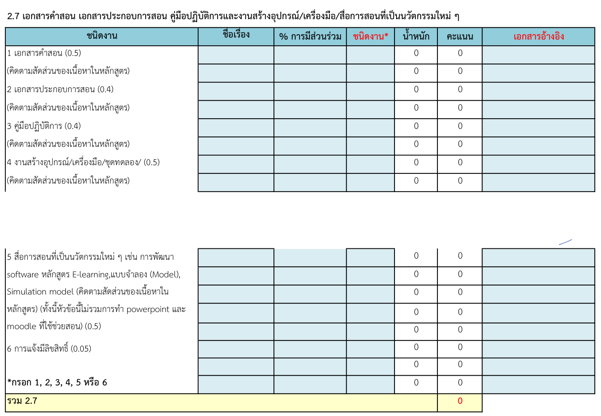

### Mapping

| ข้อมูลในแบบฟอร์ม | ตาราง | Attribute | แนวทาง / ตัวอย่าง |
| --- | --- | --- | --- |
| ชื่อเรื่อง | `work_item` | `title` | ชื่อผลงาน |
| % การมีส่วนร่วม | `faculty_work_item` | `contribution_percent` | เปอร์เซ็นต์ |
| ชนิดงาน* | `source_record` + `work_item` | `raw_record.work_type_code` + `work_type_code` | normalize ตามชนิด 1-6 |
| น้ำหนัก | `work_item` | `source_weight` | ตามชนิดงาน |
| คะแนน | `work_item` | `source_score` | ค่าจากฟอร์ม |
| หมวด | `work_item` | `category_code`, `source_section_code` | `RESEARCH`, `2.7` |
| หลักฐาน | `evidence_reference` | `label`, `s3_key` | เอกสาร/ลิขสิทธิ์/หลักฐานผลงาน |

### Mapping code / ชนิด / หน้าที่

| Code | ความหมายจากแบบฟอร์ม | Mapping / น้ำหนัก |
| --- | --- | --- |
| 1 | เอกสารคำสอน | `TEACHING_DOCUMENT`, 0.5 |
| 2 | เอกสารประกอบการสอน | `COURSE_MATERIAL`, 0.4 |
| 3 | คู่มือปฏิบัติการ | `LAB_MANUAL`, 0.4 |
| 4 | อุปกรณ์/เครื่องมือ/ชุดทดลอง | `TEACHING_EQUIPMENT`, 0.5 |
| 5 | สื่อการสอนนวัตกรรม เช่น software/E-learning/model/simulation | `TEACHING_INNOVATION`, 0.5 |
| 6 | การแจ้งมีลิขสิทธิ์ | `COPYRIGHT_NOTIFICATION`, 0.05 |

---

## 2.8.1 ทุนวิจัยภายนอกผ่าน TU-RAC หรือคณะ

**Source:** หน้า 10

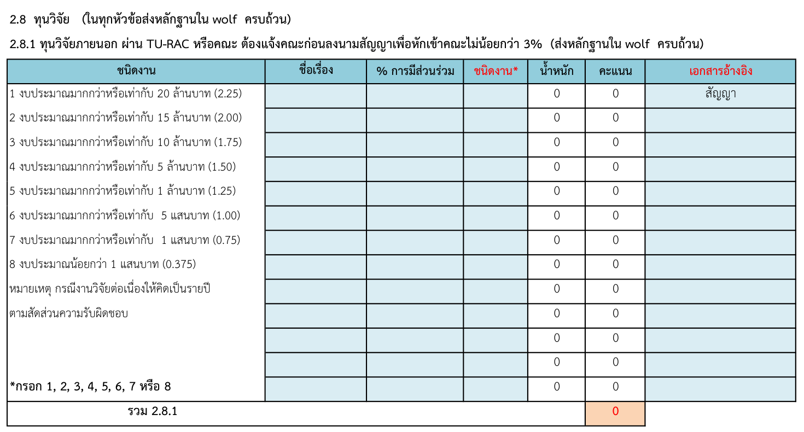

### Mapping

| ข้อมูลในแบบฟอร์ม | ตาราง | Attribute | แนวทาง / ตัวอย่าง |
| --- | --- | --- | --- |
| ชื่อเรื่อง/โครงการ | `research_project_detail` + `work_item` | `project_title` + `title` | ชื่อทุน/โครงการ |
| % การมีส่วนร่วม | `faculty_work_item` | `contribution_percent` | เปอร์เซ็นต์ |
| งบประมาณ | `research_project_detail` | `budget_amount`, `currency` | THB |
| ชนิดงาน* (ช่วงงบ) | `source_record` | `raw_record.budget_band_code` | code 1-8 |
| ประเภททุน | `research_project_detail` | `funding_type` | `EXTERNAL_GRANT` |
| เลขสัญญา | `research_project_detail` | `contract_number` | เมื่อมี |
| น้ำหนัก/คะแนน | `work_item` | `source_weight`, `source_score` | ตามช่วงงบ |
| หมวด | `work_item` | `work_type_code`, `source_section_code` | `RESEARCH_GRANT`, `2.8.1` |
| หลักฐาน | `evidence_reference` | `label`, `s3_key` | สัญญา / เอกสารทุน |

### Mapping code / ชนิด / หน้าที่

| Code | ความหมายจากแบบฟอร์ม | Mapping / น้ำหนัก |
| --- | --- | --- |
| 1 | งบ >= 20 ล้านบาท | 2.25 |
| 2 | งบ >= 15 ล้านบาท | 2.00 |
| 3 | งบ >= 10 ล้านบาท | 1.75 |
| 4 | งบ >= 5 ล้านบาท | 1.50 |
| 5 | งบ >= 1 ล้านบาท | 1.25 |
| 6 | งบ >= 500,000 | 1.00 |
| 7 | งบ >= 100,000 | 0.75 |
| 8 | งบ < 100,000 | 0.375 |

---

## 2.8.2 ทุนวิจัยอื่น ๆ

**Source:** หน้า 10

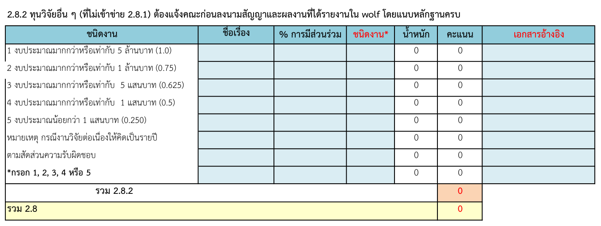

### Mapping

| ข้อมูลในแบบฟอร์ม | ตาราง | Attribute | แนวทาง / ตัวอย่าง |
| --- | --- | --- | --- |
| ชื่อเรื่อง/โครงการ | `research_project_detail` + `work_item` | `project_title` + `title` | ชื่อทุน/โครงการ |
| % การมีส่วนร่วม | `faculty_work_item` | `contribution_percent` | เปอร์เซ็นต์ |
| งบประมาณ | `research_project_detail` | `budget_amount`, `currency` | THB |
| ชนิดงาน* (ช่วงงบ) | `source_record` | `raw_record.budget_band_code` | code 1-5 |
| ประเภททุน | `research_project_detail` | `funding_type` | `OTHER_GRANT` |
| น้ำหนัก/คะแนน | `work_item` | `source_weight`, `source_score` | ตามช่วงงบ |
| หมวด | `work_item` | `work_type_code`, `source_section_code` | `RESEARCH_GRANT`, `2.8.2` |
| หลักฐาน | `evidence_reference` | `label`, `s3_key` | สัญญา/หลักฐานทุน |

### Mapping code / ชนิด / หน้าที่

| Code | ความหมายจากแบบฟอร์ม | Mapping / น้ำหนัก |
| --- | --- | --- |
| 1 | งบ >= 5 ล้านบาท | 1.0 |
| 2 | งบ >= 1 ล้านบาท | 0.75 |
| 3 | งบ >= 500,000 | 0.625 |
| 4 | งบ >= 100,000 | 0.5 |
| 5 | งบ < 100,000 | 0.250 |

---

## 2.9 รางวัลทางวิชาการในนาม มธ.

**Source:** หน้า 11

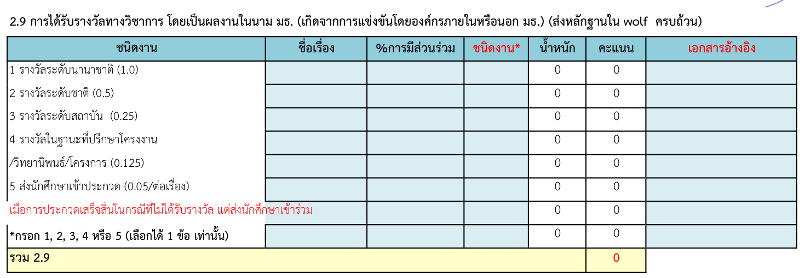

### Mapping

| ข้อมูลในแบบฟอร์ม | ตาราง | Attribute | แนวทาง / ตัวอย่าง |
| --- | --- | --- | --- |
| ชื่อเรื่อง/รางวัล | `work_item` | `title` | ชื่อรางวัลหรือรายการประกวด |
| % การมีส่วนร่วม | `faculty_work_item` | `contribution_percent` | ถ้ามีหลายผู้ร่วมงาน |
| ชนิดงาน* | `source_record` | `raw_record.award_type_code` | code 1-5 |
| ประเภท normalized | `work_item` | `work_type_code` | `ACADEMIC_AWARD` |
| จำนวนเรื่อง (กรณีส่งนักศึกษา) | `faculty_work_item` | `quantity` | ใช้กับ type 5 |
| น้ำหนัก/คะแนน | `work_item` | `source_weight`, `source_score` | ตาม source |
| หมวด | `work_item` | `source_section_code` | `2.9` |
| หลักฐาน | `evidence_reference` | `label`, `s3_key` | ประกาศรางวัล/หลักฐานการแข่งขัน |

### Mapping code / ชนิด / หน้าที่

| Code | ความหมายจากแบบฟอร์ม | Mapping / น้ำหนัก |
| --- | --- | --- |
| 1 | รางวัลระดับนานาชาติ | 1.0 |
| 2 | รางวัลระดับชาติ | 0.5 |
| 3 | รางวัลระดับสถาบัน | 0.25 |
| 4 | รางวัลในฐานะที่ปรึกษาโครงงาน/วิทยานิพนธ์/โครงการ | 0.125 |
| 5 | ส่งนักศึกษาเข้าประกวดแต่ไม่ได้รางวัล | 0.05/เรื่อง |

---

## 2.10 การนำผลงานวิจัยไปใช้ประโยชน์

**Source:** หน้า 11

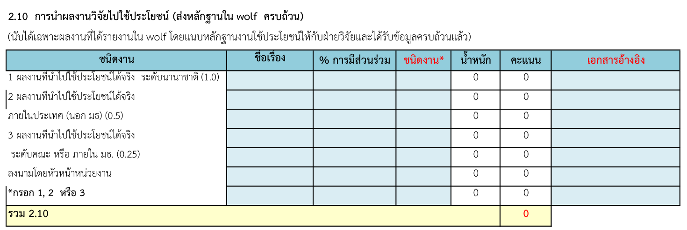

### Mapping

| ข้อมูลในแบบฟอร์ม | ตาราง | Attribute | แนวทาง / ตัวอย่าง |
| --- | --- | --- | --- |
| ชื่อเรื่อง | `work_item` | `title` | ชื่อผลงานวิจัย |
| % การมีส่วนร่วม | `faculty_work_item` | `contribution_percent` | เปอร์เซ็นต์ |
| ชนิดงาน* | `source_record` | `raw_record.utilization_level_code` | ระดับการนำไปใช้ 1-3 |
| ประเภท normalized | `work_item` | `work_type_code` | `RESEARCH_UTILIZATION` |
| น้ำหนัก/คะแนน | `work_item` | `source_weight`, `source_score` | 1.0 / 0.5 / 0.25 |
| หมวด | `work_item` | `source_section_code` | `2.10` |
| หลักฐาน | `evidence_reference` | `label`, `s3_key` | หนังสือรับรอง/หลักฐานการนำไปใช้ |

### Mapping code / ชนิด / หน้าที่

| Code | ความหมายจากแบบฟอร์ม | Mapping / น้ำหนัก |
| --- | --- | --- |
| 1 | ใช้ประโยชน์จริงระดับนานาชาติ | 1.0 |
| 2 | ใช้ประโยชน์จริงในประเทศ นอก มธ. | 0.5 |
| 3 | ใช้ประโยชน์ระดับคณะหรือภายใน มธ. | 0.25 |

---

## สรุปหมวด 2 งานวิชาการ

**Source:** หน้า 11

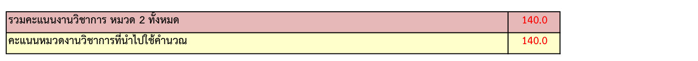

### Mapping

| ข้อมูลในแบบฟอร์ม | ตาราง | Attribute | แนวทาง / ตัวอย่าง |
| --- | --- | --- | --- |
| รวมคะแนนจริงหมวด 2 | Derived | `SUM(work_item.source_score)` | ใน source = 140.0 |
| เพดานหมวด 2 | `source_record` / rule metadata | `raw_record` | 900 คะแนน |
| คะแนนที่นำไปคำนวณ | Derived / raw audit | future scoring rule / `raw_record` | ใน source = 140.0 |

---

## 3.1 งานบริหารในตำแหน่ง

**Source:** หน้า 12

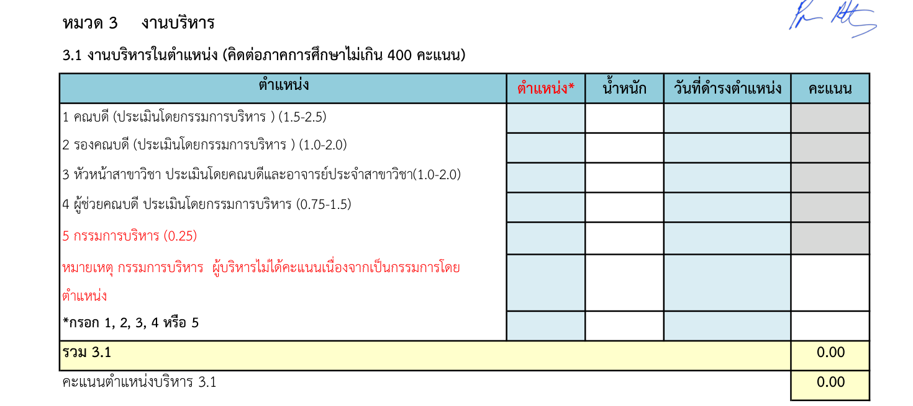

### Mapping

| ข้อมูลในแบบฟอร์ม | ตาราง | Attribute | แนวทาง / ตัวอย่าง |
| --- | --- | --- | --- |
| ตำแหน่ง* | `administration_detail` | `position_title` | คณบดี/รองคณบดี/หัวหน้าสาขา/... |
| หน่วยงาน | `administration_detail` | `organization_unit` | คณะ/สาขา |
| ประเภทแต่งตั้ง | `administration_detail` | `appointment_type` | `ADMIN_POSITION` |
| วันที่ดำรงตำแหน่ง | `administration_detail` | `appointed_from`, `appointed_to` | ช่วงวันที่ |
| น้ำหนัก/คะแนน | `work_item` | `source_weight`, `source_score` | ตามการประเมิน |
| หมวด | `work_item` | `category_code`, `work_type_code`, `source_section_code` | `ADMINISTRATION`, `ADMIN_POSITION`, `3.1` |
| คำสั่งแต่งตั้ง | `administration_detail` / `evidence_reference` | `appointment_reference` / evidence fields | เมื่อมีหลักฐาน |

### Mapping code / ชนิด / หน้าที่

| Code | ความหมายจากแบบฟอร์ม | Mapping / น้ำหนัก |
| --- | --- | --- |
| 1 | คณบดี | 1.5-2.5 |
| 2 | รองคณบดี | 1.0-2.0 |
| 3 | หัวหน้าสาขาวิชา | 1.0-2.0 |
| 4 | ผู้ช่วยคณบดี | 0.75-1.5 |
| 5 | กรรมการบริหาร | 0.25 |

### หมายเหตุ

- ช่วงน้ำหนักเป็นเกณฑ์ประเมินจาก source; เก็บค่าที่ได้จริงใน `source_weight`

---

## 3.2 งานบริหารระดับสาขาวิชา

**Source:** หน้า 12

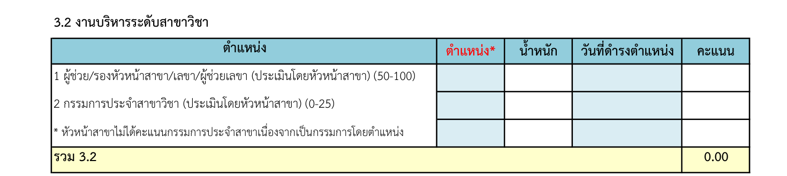

### Mapping

| ข้อมูลในแบบฟอร์ม | ตาราง | Attribute | แนวทาง / ตัวอย่าง |
| --- | --- | --- | --- |
| ตำแหน่ง* | `administration_detail` | `position_title` | ผู้ช่วย/รองหัวหน้าสาขา/เลขา/... หรือกรรมการสาขา |
| หน่วยงาน | `administration_detail` | `organization_unit` | สาขาวิชา |
| ประเภทแต่งตั้ง | `administration_detail` | `appointment_type` | `DEPARTMENT_ADMINISTRATION` |
| วันที่ดำรงตำแหน่ง | `administration_detail` | `appointed_from`, `appointed_to` | ถ้ามี |
| น้ำหนัก/คะแนน | `work_item` | `source_weight`, `source_score` | ค่าที่ประเมินจริง |
| หมวด | `work_item` | `work_type_code`, `source_section_code` | `DEPARTMENT_ADMINISTRATION`, `3.2` |
| หลักฐาน | `evidence_reference` | `label`, `s3_key` | คำสั่ง/หลักฐานแต่งตั้ง |

### Mapping code / ชนิด / หน้าที่

| Code | ความหมายจากแบบฟอร์ม | Mapping / น้ำหนัก |
| --- | --- | --- |
| 1 | ผู้ช่วย/รองหัวหน้าสาขา/เลขา/ผู้ช่วยเลขา | คะแนน 50-100 ตาม source |
| 2 | กรรมการประจำสาขาวิชา | คะแนน 0-25 ตาม source |

---

## 3.3 งานบริหารวิชาการ - ผู้ประสานงานประจำวิชา

**Source:** หน้า 12

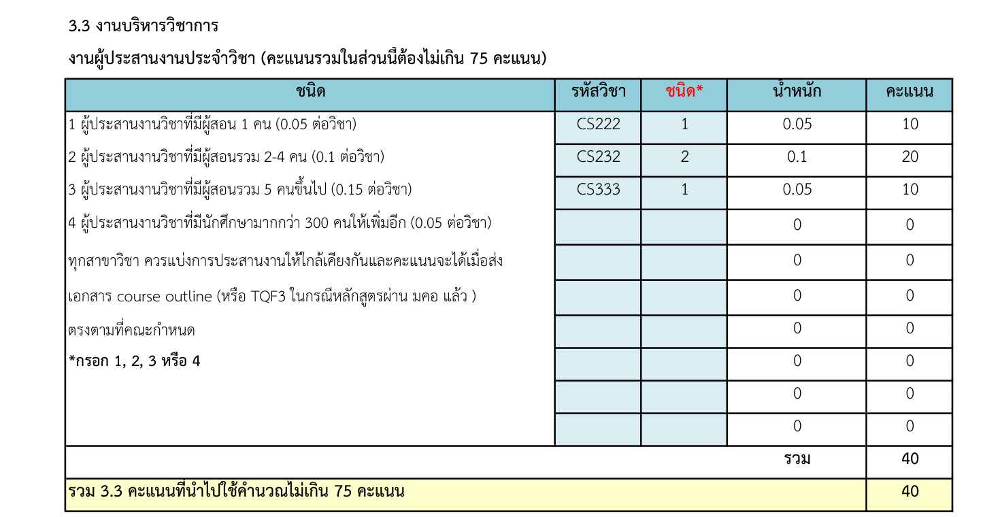

### Mapping

| ข้อมูลในแบบฟอร์ม | ตาราง | Attribute | แนวทาง / ตัวอย่าง |
| --- | --- | --- | --- |
| รหัสวิชา | `source_record` + `work_item` | `raw_record.course_code` + `title` | เช่น CS222; admin_detail ไม่มี course_code โดยตรง |
| บทบาท | `faculty_work_item` | `role` | `COURSE_COORDINATOR` |
| ชนิด* | `source_record` | `raw_record.coordinator_type_code` | code 1-4 |
| รายละเอียดบริหาร | `administration_detail` | `position_title`, `appointment_type` | `ผู้ประสานงานประจำวิชา`, `COURSE_COORDINATION` |
| น้ำหนัก/คะแนน | `work_item` | `source_weight`, `source_score` | ตามจำนวนผู้สอน/นักศึกษา |
| หมวด | `work_item` | `category_code`, `work_type_code`, `source_section_code` | `ADMINISTRATION`, `COURSE_COORDINATION`, `3.3` |
| หลักฐาน | `evidence_reference` | `label`, `s3_key` | Course outline / TQF3 |

### Mapping code / ชนิด / หน้าที่

| Code | ความหมายจากแบบฟอร์ม | Mapping / น้ำหนัก |
| --- | --- | --- |
| 1 | ผู้ประสานงาน วิชามีผู้สอน 1 คน | 0.05/วิชา |
| 2 | ผู้สอนรวม 2-4 คน | 0.1/วิชา |
| 3 | ผู้สอนรวม >=5 คน | 0.15/วิชา |
| 4 | นักศึกษา >300 คน เพิ่มอีก | 0.05/วิชา |

### ตัวอย่างจากแบบฟอร์ม

> CS222 | ชนิด 1 | น้ำหนัก 0.05 | คะแนน 10; CS232 | ชนิด 2 | น้ำหนัก 0.1 | คะแนน 20

### หมายเหตุ

- คะแนนรวม section นี้มีเพดาน 75 คะแนน

---

## 3.4 ผู้ประสานงานวิชาฝึกงาน / ฝึกภาคสนาม

**Source:** หน้า 12-13

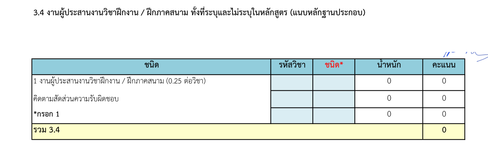

### Mapping

| ข้อมูลในแบบฟอร์ม | ตาราง | Attribute | แนวทาง / ตัวอย่าง |
| --- | --- | --- | --- |
| รหัสวิชา | `source_record` + `work_item` | `raw_record.course_code` + `title` | รหัสวิชาฝึกงาน/ภาคสนาม |
| ชนิด* | `source_record` | `raw_record.coordinator_type_code` | ใน source ใช้ code 1 |
| บทบาท | `faculty_work_item` | `role` | `INTERNSHIP_FIELD_COORDINATOR` |
| รายละเอียด | `administration_detail` | `position_title`, `appointment_type` | `ผู้ประสานงานฝึกงาน/ภาคสนาม`, `INTERNSHIP_COORDINATION` |
| สัดส่วนรับผิดชอบ | `faculty_work_item` | `contribution_percent` | ถ้ามีหลายผู้รับผิดชอบ |
| น้ำหนัก/คะแนน | `work_item` | `source_weight`, `source_score` | 0.25 ต่อวิชาตาม source |
| หมวด | `work_item` | `work_type_code`, `source_section_code` | `INTERNSHIP_COORDINATION`, `3.4` |
| หลักฐาน | `evidence_reference` | `label`, `s3_key` | เอกสารประกอบ |

### Mapping code / ชนิด / หน้าที่

| Code | ความหมายจากแบบฟอร์ม | Mapping / น้ำหนัก |
| --- | --- | --- |
| 1 | ผู้ประสานงานวิชาฝึกงาน/ฝึกภาคสนาม | 0.25 ต่อวิชา |

---

## 3.5 อาจารย์ที่ปรึกษา / PostMaster / PostDoc / Visiting Professor

**Source:** หน้า 13

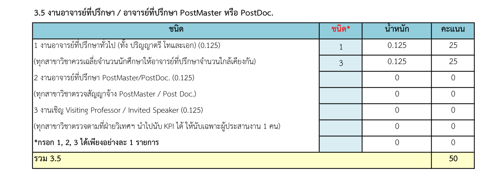

### Mapping

| ข้อมูลในแบบฟอร์ม | ตาราง | Attribute | แนวทาง / ตัวอย่าง |
| --- | --- | --- | --- |
| ชนิด 1 ที่ปรึกษาทั่วไป | `supervision_detail` | `supervision_type`, `supervision_role` | `GENERAL_ADVISOR`, `advisor` |
| ชนิด 2 ที่ปรึกษา PostMaster/PostDoc | `supervision_detail` | `supervision_type`, `supervision_role` | `POSTMASTER_POSTDOC`, `advisor` |
| ชนิด 3 เชิญ Visiting Professor/Invited Speaker | `work_item` + `source_record` | `work_type_code` + `raw_record` | `VISITING_PROFESSOR_COORDINATION`; ไม่มี detail เฉพาะใน baseline |
| ชนิด* | `source_record` | `raw_record.type_code` | เก็บเลข 1-3 |
| จำนวนรายการ | `faculty_work_item` | `quantity` | จำกัดอย่างละ 1 รายการตาม source |
| น้ำหนัก/คะแนน | `work_item` | `source_weight`, `source_score` | 0.125 / คะแนนจากฟอร์ม |
| หมวด | `work_item` | `category_code`, `source_section_code` | `ADMINISTRATION`, `3.5` |
| หลักฐาน | `evidence_reference` | `label`, `s3_key` | สัญญา/หลักฐาน KPI/หลักฐานการเป็นที่ปรึกษา |

### Mapping code / ชนิด / หน้าที่

| Code | ความหมายจากแบบฟอร์ม | Mapping / น้ำหนัก |
| --- | --- | --- |
| 1 | อาจารย์ที่ปรึกษาทั่วไป ตรี/โท/เอก | 0.125 |
| 2 | ที่ปรึกษา PostMaster/PostDoc | 0.125 |
| 3 | เชิญ Visiting Professor / Invited Speaker | 0.125 |

### ตัวอย่างจากแบบฟอร์ม

> ใน source มีชนิด 1 น้ำหนัก 0.125 คะแนน 25 และชนิด 3 น้ำหนัก 0.125 คะแนน 25

---

## สรุปหมวด 3 งานบริหาร

**Source:** หน้า 13

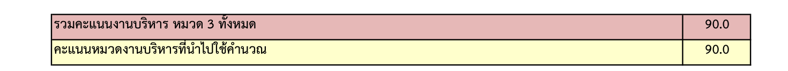

### Mapping

| ข้อมูลในแบบฟอร์ม | ตาราง | Attribute | แนวทาง / ตัวอย่าง |
| --- | --- | --- | --- |
| รวมคะแนนจริงหมวด 3 | Derived | `SUM(work_item.source_score)` | ใน source = 90.0 |
| คะแนนที่นำไปคำนวณ | Derived / raw audit | future scoring rule / `raw_record` | ใน source = 90.0 |
| เพดานงานบริหาร | `source_record` / rule metadata | `raw_record` | หน้า 1 ระบุ 400 คะแนน |

---

## 4.1.1 คณะทำงาน/คณะกรรมการระดับคณะหรือสาขา

**Source:** หน้า 14

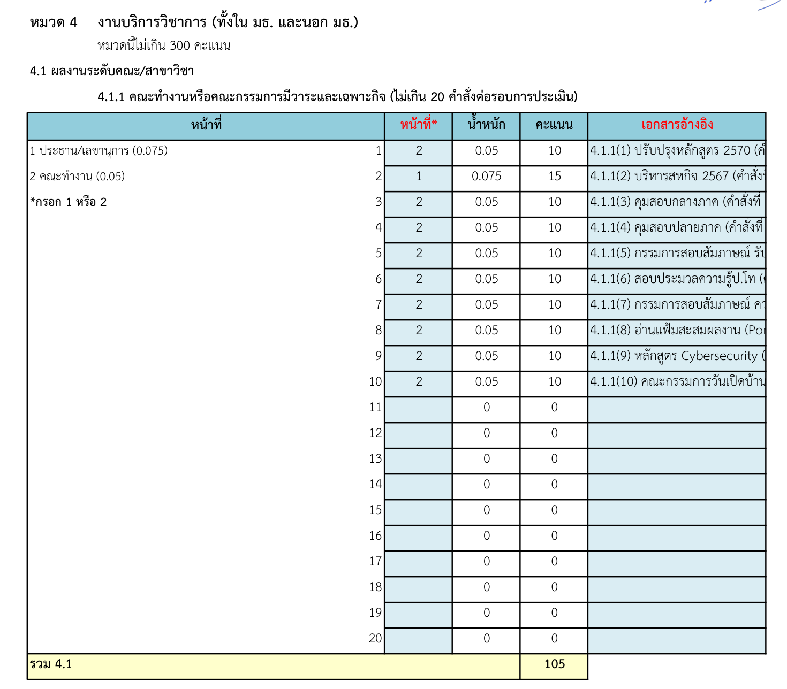

### Mapping

| ข้อมูลในแบบฟอร์ม | ตาราง | Attribute | แนวทาง / ตัวอย่าง |
| --- | --- | --- | --- |
| หน้าที่* | `service_detail` + `faculty_work_item` | `service_role` + `role` | Chair/Secretary หรือ Member/Workgroup |
| ขอบเขต | `service_detail` | `service_scope` | `INTERNAL_FACULTY_OR_DEPARTMENT` |
| ชื่อคณะ/งาน | `service_detail` | `committee_name` | จากเอกสารอ้างอิง |
| เลขคำสั่ง | `service_detail` | `order_reference` | ถ้ามีเลขคำสั่ง |
| จำนวนรายการ | `faculty_work_item` | `quantity` | 1 ต่อคำสั่ง/record |
| น้ำหนัก/คะแนน | `work_item` | `source_weight`, `source_score` | 0.075 หรือ 0.05 |
| หมวด | `work_item` | `category_code`, `work_type_code`, `source_section_code` | `SERVICE`, `COMMITTEE_SERVICE`, `4.1.1` |
| หลักฐาน | `evidence_reference` | `label`, `s3_key` | คำสั่งแต่งตั้ง |

### Mapping code / ชนิด / หน้าที่

| Code | ความหมายจากแบบฟอร์ม | Mapping / น้ำหนัก |
| --- | --- | --- |
| 1 | ประธาน/เลขานุการ | 0.075 |
| 2 | คณะทำงาน | 0.05 |

### ตัวอย่างจากแบบฟอร์ม

> 4.1.1(1) หน้าที่ 2 น้ำหนัก 0.05 คะแนน 10; 4.1.1(2) หน้าที่ 1 น้ำหนัก 0.075 คะแนน 15

### หมายเหตุ

- แบบฟอร์มจำกัดไม่เกิน 20 คำสั่งต่อรอบการประเมิน

---

## 4.2.1 คณะกรรมการ/คณะทำงานนอกคณะ ภายใน/นอก มธ.

**Source:** หน้า 14-15

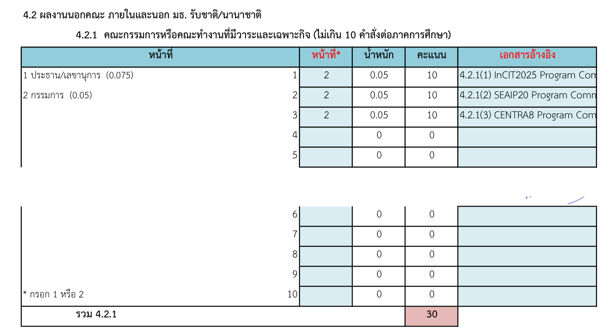

### Mapping

| ข้อมูลในแบบฟอร์ม | ตาราง | Attribute | แนวทาง / ตัวอย่าง |
| --- | --- | --- | --- |
| หน้าที่* | `service_detail` + `faculty_work_item` | `service_role` + `role` | Chair/Secretary หรือ Committee |
| ขอบเขต | `service_detail` | `service_scope` | `EXTERNAL_COMMITTEE_SERVICE` |
| องค์กร/คณะกรรมการ | `service_detail` | `organization_name`, `committee_name` | เช่น Program Committee |
| เลขคำสั่ง/อ้างอิง | `service_detail` | `order_reference` | ถ้ามี |
| น้ำหนัก/คะแนน | `work_item` | `source_weight`, `source_score` | 0.075 / 0.05 |
| หมวด | `work_item` | `work_type_code`, `source_section_code` | `COMMITTEE_SERVICE`, `4.2.1` |
| หลักฐาน | `evidence_reference` | `label`, `s3_key` | หลักฐาน appointment/committee |

### Mapping code / ชนิด / หน้าที่

| Code | ความหมายจากแบบฟอร์ม | Mapping / น้ำหนัก |
| --- | --- | --- |
| 1 | ประธาน/เลขานุการ | 0.075 |
| 2 | กรรมการ | 0.05 |

### ตัวอย่างจากแบบฟอร์ม

> InCIT2025 Program Committee / SEAIP / CENTRA8 ถูกอ้างอิงใน source

### หมายเหตุ

- จำกัดไม่เกิน 10 คำสั่งต่อภาคการศึกษา

---

## 4.2.2 ตำแหน่งบริหารนอกคณะ ภายใน มธ.

**Source:** หน้า 15

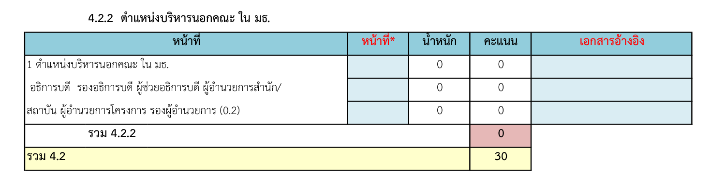

### Mapping

| ข้อมูลในแบบฟอร์ม | ตาราง | Attribute | แนวทาง / ตัวอย่าง |
| --- | --- | --- | --- |
| ตำแหน่ง | `administration_detail` | `position_title` | อธิการบดี/รอง/ผู้ช่วย/ผอ./รองผอ. ฯลฯ |
| หน่วยงาน | `administration_detail` | `organization_unit` | หน่วยงานภายใน มธ. นอกคณะ |
| ประเภทแต่งตั้ง | `administration_detail` | `appointment_type` | `EXTERNAL_TO_FACULTY_TU_ADMIN_POSITION` |
| ช่วงดำรงตำแหน่ง | `administration_detail` | `appointed_from`, `appointed_to` | ถ้ามี |
| น้ำหนัก/คะแนน | `work_item` | `source_weight`, `source_score` | 0.2 ตาม source |
| หมวด | `work_item` | `category_code`, `work_type_code`, `source_section_code` | `SERVICE`, `TU_ADMIN_SERVICE`, `4.2.2` |
| หลักฐาน | `evidence_reference` | `label`, `s3_key` | คำสั่งแต่งตั้ง |

### Mapping code / ชนิด / หน้าที่

| Code | ความหมายจากแบบฟอร์ม | Mapping / น้ำหนัก |
| --- | --- | --- |
| 1 | ตำแหน่งบริหารนอกคณะ ภายใน มธ. | 0.2 |

---

## 4.3 งานบริการทางวิชาการแก่สังคม

**Source:** หน้า 15

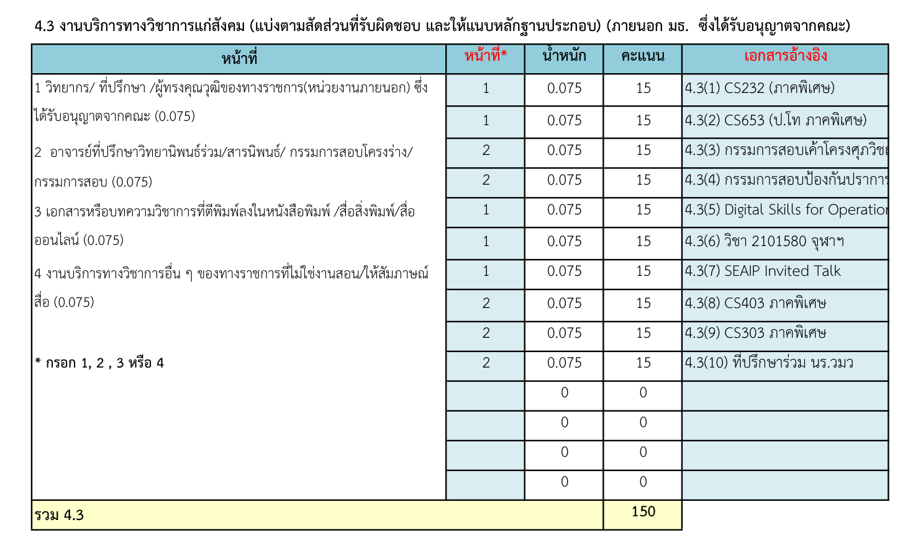

### Mapping

| ข้อมูลในแบบฟอร์ม | ตาราง | Attribute | แนวทาง / ตัวอย่าง |
| --- | --- | --- | --- |
| หน้าที่* | `service_detail` | `service_role` | Speaker/Advisor/Expert, Thesis committee, Author, Other service |
| ขอบเขต | `service_detail` | `service_scope` | `EXTERNAL_ACADEMIC_SERVICE` |
| องค์กร | `service_detail` | `organization_name` | หน่วยงานภายนอก |
| ชื่อกิจกรรม/คณะกรรมการ | `service_detail` | `committee_name` | ชื่อกิจกรรม/วิชา/งาน |
| วันที่ | `service_detail` | `service_date`, `service_end_date` | ถ้ามี |
| น้ำหนัก/คะแนน | `work_item` | `source_weight`, `source_score` | 0.075 ตาม source |
| หมวด | `work_item` | `category_code`, `work_type_code`, `source_section_code` | `SERVICE`, `ACADEMIC_SERVICE`, `4.3` |
| หลักฐาน | `evidence_reference` | `label`, `s3_key` | หนังสือเชิญ/คำสั่ง/หลักฐาน |

### Mapping code / ชนิด / หน้าที่

| Code | ความหมายจากแบบฟอร์ม | Mapping / น้ำหนัก |
| --- | --- | --- |
| 1 | วิทยากร/ที่ปรึกษา/ผู้ทรงคุณวุฒิของทางราชการภายนอก | 0.075 |
| 2 | ที่ปรึกษาวิทยานิพนธ์ร่วม/สารนิพนธ์/กรรมการสอบโครงร่าง/สอบ | 0.075 |
| 3 | เอกสาร/บทความวิชาการในหนังสือพิมพ์/สื่อสิ่งพิมพ์/ออนไลน์ | 0.075 |
| 4 | งานบริการทางวิชาการอื่นของทางราชการที่ไม่ใช่งานสอน/สัมภาษณ์สื่อ | 0.075 |

### ตัวอย่างจากแบบฟอร์ม

> source มี 10 รายการ ตัวอย่าง CS232 ภาคพิเศษ, CS653 ป.โท ภาคพิเศษ, SEAIP Invited Talk และงานกรรมการสอบ รวม 150 คะแนน

---

## 4.4 ผู้ประเมินผลงานทางวิชาการ

**Source:** หน้า 15-16

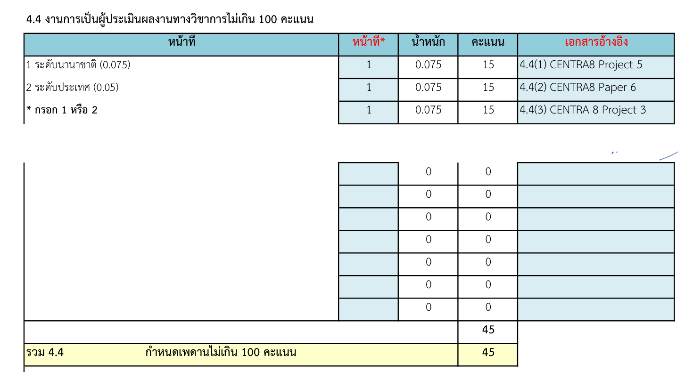

### Mapping

| ข้อมูลในแบบฟอร์ม | ตาราง | Attribute | แนวทาง / ตัวอย่าง |
| --- | --- | --- | --- |
| หน้าที่* / ระดับ | `service_detail` | `service_role`, `service_scope` | `REVIEWER`, `INTERNATIONAL` หรือ `NATIONAL` |
| ชื่อผลงาน/งานประเมิน | `work_item` | `title` | เช่น project/paper ที่ประเมิน |
| องค์กร/งานประชุม | `service_detail` | `organization_name`, `committee_name` | ถ้ามี |
| น้ำหนัก/คะแนน | `work_item` | `source_weight`, `source_score` | ตาม source |
| หมวด | `work_item` | `work_type_code`, `source_section_code` | `ACADEMIC_REVIEW`, `4.4` |
| หลักฐาน | `evidence_reference` | `label`, `s3_key` | หลักฐาน reviewer/evaluator |

### Mapping code / ชนิด / หน้าที่

| Code | ความหมายจากแบบฟอร์ม | Mapping / น้ำหนัก |
| --- | --- | --- |
| 1 | ระดับนานาชาติ | 0.075 |
| 2 | ระดับประเทศ | 0.05 |

### ตัวอย่างจากแบบฟอร์ม

> CENTRA8 Project 5 / Paper 6 / Project 3 ถูกบันทึกเป็นตัวอย่างใน source รวม 45 คะแนน

### หมายเหตุ

- source ที่กรอกจริงแสดงน้ำหนัก 0.075 ทั้ง 3 แถว; preserve ค่าที่กรอกจริงและตรวจ validation เทียบ code

---

## 4.5 ผู้ประเมินตำแหน่งทางวิชาการ

**Source:** หน้า 16

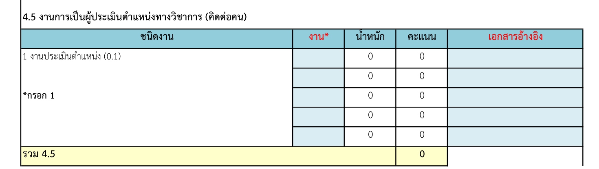

### Mapping

| ข้อมูลในแบบฟอร์ม | ตาราง | Attribute | แนวทาง / ตัวอย่าง |
| --- | --- | --- | --- |
| งาน* | `service_detail` | `service_role` | `ACADEMIC_POSITION_EVALUATOR` |
| จำนวนคน | `faculty_work_item` | `quantity` | คิดต่อคน |
| ชื่อ/หน่วยงาน | `service_detail` | `organization_name`, `committee_name` | ถ้ามี |
| น้ำหนัก/คะแนน | `work_item` | `source_weight`, `source_score` | 0.1 ต่อคนตาม source |
| หมวด | `work_item` | `work_type_code`, `source_section_code` | `ACADEMIC_POSITION_EVALUATION`, `4.5` |
| หลักฐาน | `evidence_reference` | `label`, `s3_key` | หนังสือเชิญ/แต่งตั้ง |

### Mapping code / ชนิด / หน้าที่

| Code | ความหมายจากแบบฟอร์ม | Mapping / น้ำหนัก |
| --- | --- | --- |
| 1 | งานประเมินตำแหน่ง | 0.1 ต่อคน |

---

## 4.6 Text contribution - Editor

**Source:** หน้า 16

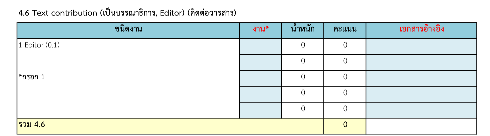

### Mapping

| ข้อมูลในแบบฟอร์ม | ตาราง | Attribute | แนวทาง / ตัวอย่าง |
| --- | --- | --- | --- |
| งาน* | `service_detail` | `service_role` | `EDITOR` |
| วารสาร | `service_detail` | `organization_name` หรือ `committee_name` | ชื่อวารสาร |
| จำนวนวารสาร | `faculty_work_item` | `quantity` | คิดต่อวารสาร |
| น้ำหนัก/คะแนน | `work_item` | `source_weight`, `source_score` | 0.1 ต่อวารสาร |
| หมวด | `work_item` | `work_type_code`, `source_section_code` | `EDITORIAL_SERVICE`, `4.6` |
| หลักฐาน | `evidence_reference` | `label`, `s3_key` | หลักฐาน editor |

### Mapping code / ชนิด / หน้าที่

| Code | ความหมายจากแบบฟอร์ม | Mapping / น้ำหนัก |
| --- | --- | --- |
| 1 | Editor | 0.1 ต่อวารสาร |

---

## สรุปหมวด 4 งานบริการวิชาการ

**Source:** หน้า 16

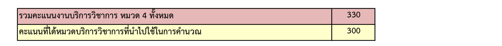

### Mapping

| ข้อมูลในแบบฟอร์ม | ตาราง | Attribute | แนวทาง / ตัวอย่าง |
| --- | --- | --- | --- |
| รวมคะแนนจริงหมวด 4 | Derived | `SUM(work_item.source_score)` | ใน source = 330 |
| เพดานหมวด 4 | `source_record` / rule metadata | `raw_record` | 300 คะแนน |
| คะแนนที่นำไปคำนวณ | Derived / raw audit | future scoring rule / `raw_record` | ใน source = 300 |

---

## ภาพรวมความสัมพันธ์ที่ใช้ซ้ำ

```text
faculty
   |
   +-- faculty_work_item -- work_item -- evidence_reference
                              |
                              +-- teaching_detail
                              +-- publication_detail
                              +-- research_project_detail
                              +-- supervision_detail
                              +-- service_detail
                              +-- administration_detail

source_record --> work_item (trace กลับข้อมูลดิบ)
academic_period / evaluation_period --> faculty_work_item
```

## Schema gaps ที่พบจากแบบฟอร์ม

| ข้อมูลจากฟอร์ม | Baseline ปัจจุบัน | แนวทาง V2 ตอนนี้ |
| --- | --- | --- |
| Presentation mode (Oral/Poster) | ไม่มี `presentation_detail` | เก็บใน `source_record.raw_record`; ถ้าต้อง query บ่อยค่อยเพิ่ม detail table |
| Patent/IP subtype | ไม่มี `patent_detail` | ใช้ `work_item` + raw code + evidence |
| Award level/type | ไม่มี `award_detail` | ใช้ `work_item` + raw code + evidence |
| Research utilization level | ไม่มี `research_utilization_detail` | ใช้ `work_item` + raw code + evidence |
| Course code ในงานผู้ประสานงาน 3.3/3.4 | `administration_detail` ไม่มี course_code | เก็บ code ใน raw + ใช้ `work_item.title`; ค่อยเพิ่ม field/table เมื่อ requirement ชัด |
| Student identity ใน 1.9 | ตั้งใจไม่เก็บแบบเปิดเผย | เก็บเฉพาะ `student_count` + `student_identifier_policy=REDACTED`; raw source จำกัดสิทธิ์ |

## Coverage

- จำนวนภาพที่แคป: **45 ตาราง/สรุป**
- ครอบคลุมหมวด 1 งานสอน, หมวด 2 งานวิชาการ, หมวด 3 งานบริหาร และหมวด 4 งานบริการวิชาการ ตาม PDF ที่ให้มา
- หมวด 5 คะแนนพิเศษมีเพียงบรรทัดสรุปในหน้า 1 และไม่มีตารางรายละเอียดใน PDF ฉบับนี้
