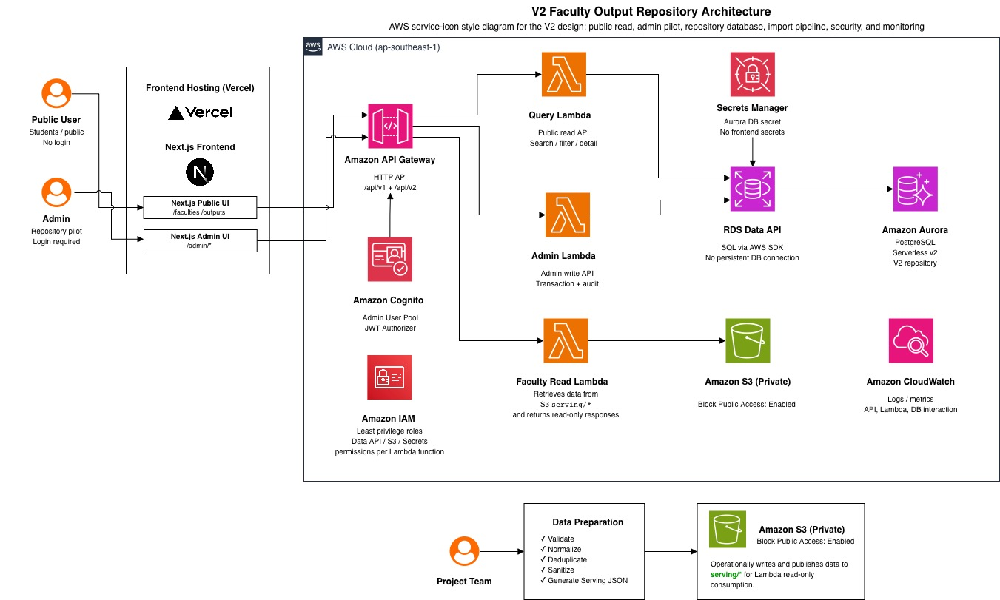

# V2 Central Design: Faculty Output Repository

สถานะ: Draft for team review  
ขอบเขต: Issue #46 - Freeze Scope, Architecture & Interface Contracts  
วันที่จัดทำ: 2026-09-12  

เอกสารนี้เป็น baseline กลางของ V2 สำหรับให้ทีม Data, Backend, Cloud, Frontend และ QA/Integration ใช้อ้างอิงร่วมกันก่อนเริ่ม implementation card ถัดไป

> กติกาสำคัญ: ถ้าต้องเปลี่ยน scope, route name, entity name, visibility rule หรือ V1 compatibility rule หลังจากเอกสารนี้ถูก review แล้ว ให้เปิด decision/update แยก ไม่แก้เงียบในงาน implementation

---

## 1. Executive Summary

V2 คือ **Faculty Output Repository** หรือระบบจัดเก็บข้อมูลผลงานและภาระงานอาจารย์แบบมีโครงสร้าง รองรับหลายปีการศึกษา ค้นหา กรอง และเรียกดูรายละเอียดได้ตามเงื่อนไข

V1 ปัจจุบันเป็น public read-only faculty information service ที่แสดงข้อมูลอาจารย์และผลงานบางส่วนจาก serving JSON บน S3 ผ่าน Lambda/API Gateway ไปยัง Next.js frontend

V2 จะเพิ่ม managed repository layer โดยใช้ Aurora PostgreSQL เป็น repository หลัก และให้ API อ่าน/เขียนข้อมูลผ่าน Lambda + RDS Data API โดยมี S3 เป็นพื้นที่เก็บ source, evidence metadata/archive/export และมี Cognito สำหรับ Admin pilot เท่านั้น

V2 ยังไม่ใช่ระบบ workspace เต็มรูปแบบสำหรับอาจารย์หรือผู้ตรวจสอบ การ์ดนี้จึง freeze ให้ชัดว่า V2 เป็น repository foundation และ admin pilot ไม่ใช่ V3 Secure Faculty Workspace

---

## 2. V2 Product Definition

V2 คือ **Managed Multi-year Faculty Output Repository**

ระบบต้องจัดเก็บและเรียกดูข้อมูลต่อไปนี้จากแหล่งข้อมูลที่จัดการได้อย่างเป็นระบบ:

- ข้อมูลอาจารย์
- ประวัติการศึกษาและความเชี่ยวชาญ
- งานสอน
- งานวิจัย
- ผลงานตีพิมพ์ / publication
- งานบริการวิชาการ
- การดูแลนักศึกษา / supervision
- งานบริหาร
- หลักฐานหรือเอกสารอ้างอิงในรูปแบบ metadata/reference
- provenance ของการนำเข้าและแหล่งข้อมูล
- ข้อมูลหลายปีการศึกษาและหลายรอบประเมิน
- การค้นหา กรอง และเรียกดูรายละเอียดตามเงื่อนไข

V2 มี Admin pilot สำหรับจัดการ repository ได้ในขอบเขตจำกัด ได้แก่ create, edit, soft delete, restore optional, assign faculty, assign period, assign category/type และจัดการ evidence reference metadata

---

## 3. Relationship Between V1, V2, and V3

| Version | บทบาท | สถานะข้อมูล | การยืนยันตัวตน | สิ่งที่ผู้ใช้ทำได้ |
|---|---|---|---|---|
| V1 | Public read-only faculty information service | Public-safe serving JSON | ไม่ต้อง login | ดูรายชื่ออาจารย์ ดูโปรไฟล์ ค้นหา/กรองข้อมูลสาธารณะ |
| V2 | Managed faculty output repository | Aurora repository + S3 source/evidence/export | Admin pilot เท่านั้น | Admin จัดการ work item และข้อมูล repository ขั้นต้น |
| V3 | Secure faculty workspace | Repository ที่มี workflow และ role ชัดเจน | Role-based authentication | Faculty/staff/reviewer ทำงานตามบทบาทและ workflow |

V2 ไม่แทนที่ V1 แบบทำลายของเดิม แต่เพิ่ม repository ที่สามารถสร้าง public-safe projection กลับไปเลี้ยง V1 หรือ public frontend ได้ในอนาคต

---

## 4. V2 In Scope

- Preserve V1 public faculty experience เดิม
- เพิ่ม architecture สำหรับ managed repository
- ใช้ relational domain model
- รองรับหลาย academic year และ semester
- รองรับ evaluation period แยกจาก academic period
- รองรับ search/filter ตาม faculty, year, semester, category, type, visibility และ keyword
- รองรับ work item detail แยกตามประเภทงาน
- รองรับ controlled import จาก source files
- รองรับ provenance และ source record tracking
- รองรับ evidence reference metadata โดยไม่เปิดไฟล์หลักฐานให้ public
- กำหนด data visibility เป็น `PUBLIC`, `INTERNAL`, `RESTRICTED`
- กำหนด Admin-only CRUD pilot boundary
- กำหนด route/API/entity baseline เพื่อให้การ์ด #47-#67 ทำต่อได้

---

## 5. V2 Out of Scope

สิ่งต่อไปนี้ไม่อยู่ใน V2 baseline และต้องไม่ถูกผูกเป็น blocker ของ V2:

- Faculty self-service
- Staff workspace
- Reviewer workspace
- Manager dashboard
- Dynamic multi-role RBAC
- Approval workflow
- Submit / reject / return workflow
- Official workload score calculation engine
- Official workload sheet generation
- Annual report generation
- Department aggregation dashboard
- Full evidence upload/download workflow
- Advanced BI / analytics
- OpenSearch
- RDS Proxy
- ECS / EKS
- Full Infrastructure as Code automation
- Performance/cost before-after optimization

CloudFront เป็น optional/deferred service ใช้ได้เฉพาะกรณีต้องการ public CDN หรือ static distribution เพิ่มเติม ไม่ใช่ dependency หลักของ V2

---

## 6. Target Architecture

ภาพ architecture สำหรับ V2:



### 6.1 Primary Request Flow

```text
Public User / Admin
        ↓
Next.js Frontend on Vercel
        ↓
Amazon API Gateway HTTP API
        ↓
AWS Lambda
        ↓
Amazon RDS Data API
        ↓
Aurora PostgreSQL Serverless v2
```

### 6.2 Admin Auth Flow

```text
Admin
        ↓
Next.js Admin UI
        ↓
Amazon Cognito User Pool
        ↓
JWT token
        ↓
API Gateway JWT Authorizer
        ↓
Admin Lambda
```

### 6.3 Import / Projection Flow

```text
Project Team source files
        ↓
Data preparation
        ↓
S3 landing/archive
        ↓
Import Lambda
        ↓
RDS Data API
        ↓
Aurora repository
        ↓
Projection Lambda
        ↓
S3 exports/public-serving
        ↓
V1-compatible public responses
```

---

## 7. AWS Service Responsibilities

| Service | Responsibility | V2 rule |
|---|---|---|
| Vercel / Next.js | Public UI และ Admin UI | ห้ามเข้าถึง Aurora, S3, Secrets โดยตรง |
| Amazon API Gateway HTTP API | Public HTTPS API entrypoint | แยก public read routes และ admin protected routes |
| Amazon Cognito User Pool | Admin pilot authentication | ใช้กับ `/api/v2/admin/*` เท่านั้นใน V2 |
| Query Lambda | อ่านข้อมูล public/internal-safe ตาม API contract | ไม่ทำ admin write |
| Admin Lambda | Create/edit/soft delete repository records | ต้องตรวจ auth และเขียน audit event |
| Import Lambda | Validate/normalize/import source data | ต้อง idempotent และบันทึก import/source provenance |
| Projection Lambda | สร้าง public-safe projection | ต้อง preserve V1 response shape และ old slugs |
| RDS Data API | SQL access layer ผ่าน AWS SDK | ลดความจำเป็นต้องมี persistent DB connection ใน Lambda |
| Aurora PostgreSQL Serverless v2 | Managed repository หลักของ V2 | เป็น source of truth สำหรับ V2 domain data |
| Amazon S3 Private Bucket | landing/archive/evidence/metadata/exports/public-serving | Block Public Access ต้อง enabled |
| AWS Secrets Manager | เก็บ Aurora DB secret | frontend ห้ามเห็น secret |
| AWS IAM | Least privilege ระหว่าง services | แยก role ตาม Lambda responsibility |
| Amazon CloudWatch | Logs, metrics, alarms | ใช้ตรวจ API 5xx, Lambda error, DB latency, import failure |
| Amazon CloudFront | Optional/deferred public CDN | ไม่ใช่ blocker ของ V2 |

---

## 8. Security and Access Boundaries

### 8.1 Core Security Rules

- Public user ไม่ต้อง login แต่เห็นเฉพาะข้อมูล `PUBLIC`
- Admin pilot ต้อง login ผ่าน Cognito
- Frontend hiding ไม่ถือเป็น security control
- Backend/API ต้อง enforce visibility และ authorization เสมอ
- S3 bucket ต้อง private และเปิด Block Public Access
- Aurora, S3 และ Secrets Manager ต้องไม่ถูกเรียกจาก browser โดยตรง
- IAM role ต้อง scoped ตามหน้าที่ ไม่ใช้ broad wildcard policy

### 8.2 Data Visibility Levels

| Visibility | ความหมาย | ตัวอย่างข้อมูล | เข้าถึงได้โดย |
|---|---|---|---|
| `PUBLIC` | เปิดเผยต่อสาธารณะได้ | ชื่ออาจารย์ ความเชี่ยวชาญ ผลงานตีพิมพ์ public profile | Public API / Public UI |
| `INTERNAL` | ใช้ภายในสาขาหรือทีมที่ได้รับสิทธิ์ | ภาระงานสอน งานบริการภายใน รายละเอียด contribution | Admin pilot / internal API ในอนาคต |
| `RESTRICTED` | มีข้อมูลละเอียดอ่อนหรือระบุตัวบุคคล | student-identifying supervision, sensitive evidence | ไม่เปิดใน public API; ต้องมี workflow/role ใน V3 |

### 8.3 Public API Visibility Rule

Public API ต้อง return เฉพาะ record/field ที่ public-safe เท่านั้น

การที่ frontend ไม่แสดง field ไม่เพียงพอ เพราะ response payload, network log หรือ direct API call ยังเข้าถึงข้อมูลได้ถ้า backend ไม่กรอง

---

## 9. Core Domain Entities

Entity names ต่อไปนี้เป็น baseline ที่ freeze สำหรับ #47 เป็นต้นไป:

| Entity | Responsibility |
|---|---|
| `faculty` | ข้อมูลหลักของอาจารย์ เช่น name, slug, position, email, status |
| `faculty_education` | ประวัติการศึกษาของอาจารย์ |
| `faculty_interest` | ความเชี่ยวชาญ / research interest / keyword |
| `academic_period` | ปีการศึกษาและภาคเรียน เช่น `2/2567` |
| `evaluation_period` | รอบประเมินหรือช่วงที่ใช้รวบรวมงาน อาจไม่ตรงกับ calendar year |
| `work_category` | หมวดใหญ่ของงาน เช่น teaching, research, publication, service, supervision, administration |
| `work_type` | ประเภทย่อยภายใต้ category |
| `work_item` | แกนกลางของผลงานหรือภาระงานทุกประเภท |
| `faculty_work_item` | ตารางเชื่อม faculty กับ work item พร้อม role/contribution |
| `teaching_detail` | รายละเอียดเฉพาะงานสอน |
| `publication_detail` | รายละเอียดเฉพาะผลงานตีพิมพ์ |
| `research_project_detail` | รายละเอียดเฉพาะโครงการวิจัย |
| `supervision_detail` | รายละเอียดเฉพาะการดูแลนักศึกษา |
| `service_detail` | รายละเอียดเฉพาะงานบริการ |
| `administration_detail` | รายละเอียดเฉพาะงานบริหาร |
| `evidence_reference` | metadata/reference ของหลักฐาน |
| `import_batch` | รอบการนำเข้าข้อมูล |
| `source_record` | แถว/record ต้นทางและ provenance |
| `audit_event` | ประวัติ admin action/import/projection ที่ตรวจสอบย้อนหลังได้ |

---

## 10. Modeling Decisions

### 10.1 `work_item` Is the Central Aggregate

`work_item` เป็นแกนกลางของข้อมูลผลงานและภาระงานทุกประเภท เพื่อให้ระบบค้นหา กรอง แสดงรายการ และทำ pagination ได้ด้วย model เดียว

รายละเอียดเฉพาะประเภทงานแยกไปอยู่ใน subtype tables:

- `teaching_detail`
- `publication_detail`
- `research_project_detail`
- `supervision_detail`
- `service_detail`
- `administration_detail`

เหตุผล:

- ลดการบังคับให้ทุก category ใช้ column เดียวกันแบบไม่เหมาะสม
- รองรับรายละเอียดเฉพาะแต่ละงานโดยไม่ทำให้ `work_item` หนักเกินไป
- ทำให้ list/search API ใช้ field กลางได้ และ detail API ค่อยแนบ subtype detail

### 10.2 `faculty_work_item` Handles Many-to-Many Contribution

ผลงานหนึ่งรายการอาจมีอาจารย์หลายคน และอาจารย์แต่ละคนมี role/contribution ต่างกัน จึงห้ามผูก `work_item` กับ `faculty_id` ตรง ๆ แบบ one-to-many

`faculty_work_item` ต้องรองรับอย่างน้อย:

- `faculty_id`
- `work_item_id`
- `role`
- `contribution_order`
- `contribution_note`
- optional `contribution_percent`

### 10.3 Academic Period and Evaluation Period Are Different

`academic_period` และ `evaluation_period` ต้องแยกกัน

ตัวอย่าง: ภาคเรียน `2/2567` อาจเกิดในปีปฏิทิน 2568 ดังนั้นห้าม derive academic year จาก `activity_date` หรือ calendar year โดยตรง

### 10.4 Source Form Is Not Database Schema

แบบฟอร์มภาระงานหรือ source spreadsheet เป็น input format ไม่ใช่ schema ของ repository

การออกแบบฐานข้อมูลต้อง map ข้อมูลจาก source เข้าสู่ domain model ไม่ copy โครงสร้างฟอร์ม 1:1 เพราะ V2 ต้องรองรับหลายแหล่งข้อมูล หลายปี และหลายรูปแบบงาน

---

## 11. API Namespace and Route Baseline

### 11.1 V1 API Must Remain Stable

```http
GET /api/v1/faculties
GET /api/v1/faculties/{id}
```

ห้ามทำ breaking change กับ response shape เดิมของ V1 โดยไม่มี compatibility layer

### 11.2 V2 Read API

```http
GET /api/v2/academic-periods
GET /api/v2/work-categories
GET /api/v2/work-types
GET /api/v2/faculties

GET /api/v2/work-items
GET /api/v2/work-items/{id}
GET /api/v2/faculties/{faculty_id}/work-items
```

### 11.3 Work Item List Query Parameters

Baseline query parameters:

| Parameter | Meaning | Example |
|---|---|---|
| `faculty_id` | filter by faculty | `faculty_id=fac_001` |
| `academic_period_id` | filter by academic period | `academic_period_id=ap_2567_2` |
| `evaluation_period_id` | filter by evaluation period | `evaluation_period_id=eval_2567` |
| `category` | filter by work category code | `category=publication` |
| `type` | filter by work type code | `type=journal_article` |
| `visibility` | filter by visibility, backend-enforced | `visibility=PUBLIC` |
| `q` | keyword search | `q=cloud` |
| `page` | pagination page | `page=1` |
| `page_size` | pagination size | `page_size=20` |

### 11.4 Baseline List Response Shape

```json
{
  "items": [
    {
      "id": "wi_001",
      "title": "ตัวอย่างผลงาน",
      "category": "publication",
      "type": "journal_article",
      "academic_period": {
        "id": "ap_2567_2",
        "label": "2/2567"
      },
      "faculty": [
        {
          "id": "fac_001",
          "display_name": "ผศ. ดร. ตัวอย่าง",
          "slug": "example-faculty",
          "role": "author"
        }
      ],
      "visibility": "PUBLIC",
      "updated_at": "2026-09-12T00:00:00Z"
    }
  ],
  "page": 1,
  "page_size": 20,
  "total": 1
}
```

### 11.5 Baseline Detail Response Shape

```json
{
  "id": "wi_001",
  "title": "ตัวอย่างผลงาน",
  "description": "รายละเอียดแบบย่อ",
  "category": "publication",
  "type": "journal_article",
  "visibility": "PUBLIC",
  "academic_period": {
    "id": "ap_2567_2",
    "label": "2/2567"
  },
  "faculty": [
    {
      "id": "fac_001",
      "display_name": "ผศ. ดร. ตัวอย่าง",
      "slug": "example-faculty",
      "role": "author",
      "contribution_order": 1
    }
  ],
  "detail": {
    "kind": "publication",
    "publication_title": "ตัวอย่างบทความ",
    "venue": "Example Journal",
    "publication_year": 2568
  },
  "evidence": [
    {
      "id": "ev_001",
      "label": "metadata only",
      "visibility": "INTERNAL"
    }
  ],
  "updated_at": "2026-09-12T00:00:00Z"
}
```

Public detail response ต้อง redact/omit field ที่ไม่ public-safe

### 11.6 V2 Admin Pilot API

```http
POST   /api/v2/admin/work-items
GET    /api/v2/admin/work-items/{id}
PATCH  /api/v2/admin/work-items/{id}
DELETE /api/v2/admin/work-items/{id}
POST   /api/v2/admin/work-items/{id}/restore
```

`DELETE` หมายถึง soft delete เป็น default

### 11.7 Baseline Error Shape

```json
{
  "error": {
    "code": "VALIDATION_ERROR",
    "message": "Invalid request",
    "details": [
      {
        "field": "title",
        "message": "title is required"
      }
    ],
    "request_id": "req_123"
  }
}
```

Baseline status codes:

| Status | Meaning |
|---|---|
| `200` | success |
| `201` | created |
| `400` | validation error |
| `401` | missing/invalid auth |
| `403` | authenticated but not allowed |
| `404` | resource not found or not visible |
| `409` | conflict/idempotency duplicate |
| `500` | unexpected server error |

---

## 12. Frontend Route Baseline

### 12.1 V1 Routes Must Remain

```text
/faculties
/faculties/{id}
```

### 12.2 V2 Repository Routes

```text
/outputs
/outputs/{id}
```

### 12.3 V2 Admin Pilot Routes

```text
/admin/login
/admin/work-items
/admin/work-items/new
/admin/work-items/{id}
```

### 12.4 UI Responsibility Split

| UI area | Responsibility | Data source |
|---|---|---|
| V1 faculty pages | Public faculty profile experience | Existing `/api/v1` contract |
| V2 repository pages | Search/filter/browse work items | `/api/v2/work-items` |
| V2 detail page | Show work item detail with public-safe fields | `/api/v2/work-items/{id}` |
| Admin login | Authenticate admin pilot user | Cognito |
| Admin work item list/form | Manage repository records | `/api/v2/admin/*` |

---

## 13. Admin Pilot Boundary

V2 Admin pilot มี human login role เดียวคือ `ADMIN`

Schema มี `SYSTEM` role สำหรับ non-human actor เช่น import, projection, migration และ automated audit event เท่านั้น ไม่ใช่ user ที่ login ผ่านหน้า admin

Admin ทำได้:

- Login
- Browse work items
- Create work item
- Edit work item
- Soft delete work item
- Restore work item ถ้าทีมเลือกเปิดใช้
- Assign faculty
- Assign academic period
- Select category/type
- Add subtype detail
- Add evidence reference metadata
- View basic import/audit context ถ้ามี

Admin ยังทำไม่ได้:

- จัดการ role แบบ dynamic
- impersonate faculty
- ให้ faculty แก้ข้อมูลของตัวเอง
- ทำ approval workflow
- submit / reject / return records
- generate official workload sheet
- generate official annual report
- ดูหรือดาวน์โหลด restricted evidence โดยไม่มี V3 access model

---

## 14. V1 Compatibility Rule

V1 ต้องไม่พัง

สิ่งต่อไปนี้ต้องยังทำงานได้:

- `/faculties`
- `/faculties/{id}`
- `/api/v1/faculties`
- `/api/v1/faculties/{id}`
- faculty public slug เดิม เช่น `prapaporn-rattanatamrong`

Rules:

- ห้ามเปลี่ยน route เดิมแบบ breaking change
- ห้ามเปลี่ยน response shape เดิมของ `/api/v1` โดยไม่มี adapter/projection
- public slug เดิมต้อง preserve
- V2 projection ต้อง public-safe เท่านั้น
- ถ้า V2 สร้าง public-serving JSON ให้ V1 ในอนาคต ต้องมี compatibility verification ก่อน deploy

---

## 15. Import, Provenance, and Evidence Boundary

### 15.1 Controlled Import

V2 รับข้อมูลจาก source ที่ทีมควบคุม เช่น CSV, JSON, XLSX หรือ prepared dataset

Import flow ต้อง:

- validate structure
- normalize values
- deduplicate records
- map source field เข้า V2 domain model
- record `import_batch`
- record `source_record`
- support idempotent rerun
- report rejected rows with reason

### 15.2 Provenance

ทุก work item ที่มาจาก import ควรตรวจสอบย้อนหลังได้ว่า:

- มาจาก import batch ใด
- มาจาก source file/row ใด
- ถูก transform ด้วย mapping rule ใด
- ถูกแก้ไขเพิ่มเติมโดย admin หรือไม่

### 15.3 Evidence

V2 เก็บ evidence ในรูปแบบ reference/metadata ก่อน ไม่ใช่ full evidence workflow

`evidence_reference` ควรรองรับ:

- label/name
- evidence type
- storage reference หรือ external reference
- visibility
- linked work item
- source/import context

Restricted evidence ห้ามเปิดผ่าน public API

---

## 16. Dependency Map for Issues #47-#67

| Issue | Uses baseline from #46 | Notes |
|---|---|---|
| #47 Design Relational Schema & SQL Migration | entity names, modeling decisions, visibility, period model | ต้องไม่เปลี่ยน vocabulary หลักโดยไม่มี decision update |
| #48 Provision Aurora / Data API / Secret / IAM | target architecture, service responsibilities | ใช้ Aurora + Data API + Secrets + IAM ตามที่ freeze |
| #49 Define V1 to V2 Data Mapping | V1 compatibility, domain model, import/provenance boundary | source form map เข้า domain model ไม่ copy 1:1 |
| #50 Prepare Multi-Year Demo Dataset | product definition, category coverage, period model | demo data ต้องครอบคลุมหลายปีและหลาย category |
| #51 Build Master Data API | route baseline, master entity names | academic periods, categories, work types |
| #52 Build Work Item List/Search/Filter API | query params, response shape, visibility rule | enforce public-safe filtering ที่ backend |
| #53 Build Faculty Work Items API | `faculty_work_item`, V1 faculty compatibility | faculty detail ต้องโยง work items ได้ |
| #54 Build Work Item Detail API | detail response shape, subtype detail model | redact restricted/internal fields ใน public response |
| #55 Configure Admin Authentication | Cognito boundary, admin pilot scope | human login role เดียวคือ `ADMIN`; `SYSTEM` เป็น audit actor ภายใน |
| #56 Build Admin Create Work Item API | admin routes, audit/provenance expectation | create transaction + audit event |
| #57 Build Admin Update / Soft Delete API | admin routes, soft delete rule | DELETE = soft delete |
| #58 Build Repository Page Shell & Filter UI | frontend route baseline | `/outputs` |
| #59 Build Repository Result List & Pagination UI | list response shape | search/filter/pagination |
| #60 Build Work Item Detail UI | detail response shape | `/outputs/{id}` |
| #61 Integrate Repository UI with Real API | V2 read API baseline | connect public repository UI |
| #62 Build Admin Login UI | Cognito + admin route baseline | `/admin/login` |
| #63 Build Admin Work Item List UI | admin route baseline | `/admin/work-items` |
| #64 Build Admin Create/Edit Form UI | admin fields, subtype detail boundary | `/admin/work-items/new`, `/admin/work-items/{id}` |
| #65 Integrate Admin UI with Auth & CRUD API | Cognito + admin APIs | token handling and CRUD integration |
| #66 Execute Migration & Preserve V1 Compatibility | V1 compatibility rule, projection rule | verify `/api/v1` and slugs still work |
| #67 Final Integration / Deploy / Demo Docs | full baseline and Definition of Done | final demo must show V1 preserved and V2 working |

---

## 17. Deferred Services and Explicit Non-Blockers

| Service/Capability | V2 decision |
|---|---|
| CloudFront | Optional/deferred; use only if public CDN/static distribution is needed |
| OpenSearch | Deferred; keyword search starts with DB-backed search/filter |
| RDS Proxy | Deferred; Data API is baseline for Lambda DB access |
| ECS/EKS | Out of scope; Lambda is baseline compute |
| Full IaC automation | Out of scope for V2 baseline; may be V5 direction |
| Multi-role RBAC | V3 scope, not V2 |
| Approval workflow | V3 scope, not V2 |
| Official workload scoring/reporting | V7 direction, not V2 |

---

## 18. Definition of Done for Issue #46

Issue #46 is done when the team can start #47-#67 without re-debating:

- V2 scope
- V2 out-of-scope
- V2/V3 boundary
- AWS architecture direction
- service responsibility split
- entity vocabulary
- `work_item` / `faculty_work_item` modeling decision
- academic/evaluation period distinction
- data visibility boundary
- API namespace
- frontend route baseline
- admin pilot boundary
- V1 compatibility rule
- issue dependency map

---

## 19. Acceptance Criteria Traceability

| Acceptance criterion | Status | Evidence |
|---|---|---|
| เขียน V2 product definition แล้ว | Done | Section 2 |
| ทีม review และ approve V2 product definition แล้ว | Pending team review | Section 21 |
| ระบุ V2 in-scope ชัดเจน | Done | Section 4 |
| ระบุ V2 out-of-scope ชัดเจน | Done | Section 5 |
| ระบุ V2+ Admin pilot boundary ชัดเจน | Done | Section 13 |
| ระบุชัดว่า Admin pilot ไม่ใช่ V3 Secure Faculty Workspace | Done | Section 3, Section 13 |
| เอกสาร target architecture พร้อมแล้ว | Done | Section 6 |
| เอกสาร AWS service responsibilities พร้อมแล้ว | Done | Section 7 |
| freeze core entity names แล้ว | Done | Section 9 |
| บันทึก modeling decision ของ `work_item` และ `faculty_work_item` แล้ว | Done | Section 10 |
| บันทึกว่า `academic_period` และ `evaluation_period` เป็นคนละ concept แล้ว | Done | Section 10.3 |
| บันทึก visibility values `PUBLIC`, `INTERNAL`, `RESTRICTED` แล้ว | Done | Section 8 |
| บันทึก public API visibility rule แล้ว | Done | Section 8.3 |
| บันทึก V1 compatibility rule แล้ว | Done | Section 14 |
| ระบุว่าต้อง preserve V1 public slug เดิม | Done | Section 14 |
| ระบุว่า `/api/v1` ห้าม breaking change | Done | Section 11.1, Section 14 |
| approve V2 API namespace `/api/v2` แล้ว | Pending team review | Section 11 |
| approve frontend route baseline แล้ว | Pending team review | Section 12 |
| approve admin API route baseline แล้ว | Pending team review | Section 11.6 |
| ระบุ deferred services แล้ว | Done | Section 17 |
| บันทึก issue dependency map สำหรับงาน V2 ที่เหลือแล้ว | Done | Section 16 |
| มี team review/sign-off section พร้อมสถานะ | Done | Section 21 |

---

## 20. Review Checklist

### Architecture / Tech Lead

- [ ] Architecture เหมาะกับ V2
- [ ] V1 compatibility ได้รับการป้องกัน
- [ ] V2/V3 boundary ชัดเจน
- [ ] Service responsibility split ชัดเจน

### Data / Database

- [ ] Entity names ใช้ได้
- [ ] Multi-year model ชัดเจน
- [ ] แบบฟอร์มภาระงานถูก map เข้า domain model ไม่ใช่ copy schema 1:1
- [ ] Visibility classification เพียงพอต่อการออกแบบ schema

### Backend

- [ ] API namespace และ routes implement ได้
- [ ] Query/Admin responsibility split ชัดเจน
- [ ] Error/security expectations ชัดเจน
- [ ] Public-safe filtering enforce ที่ backend ได้

### Cloud / AWS

- [ ] Service choices เหมาะกับ target region
- [ ] IAM/Secrets/Data API direction ใช้ได้
- [ ] Deferred services เหมาะสม
- [ ] Observability baseline เพียงพอสำหรับ V2

### Frontend

- [ ] Route baseline ใช้ได้
- [ ] Repository UI และ Admin UI boundary ชัดเจน
- [ ] V1 frontend compatibility ได้รับการป้องกัน
- [ ] UI ไม่ถูกใช้เป็น security boundary

### QA / Integration

- [ ] Definition of Done ตรวจสอบได้
- [ ] Security boundaries ทดสอบได้
- [ ] การ์ดถัดไปสามารถ verify แยกกันได้
- [ ] V1 compatibility test scope ชัดเจน

---

## 21. Team Review / Sign-off

| Role | Reviewer | Status | Notes |
|---|---|---|---|
| Architecture / Tech Lead | TBD | Pending | Review scope, architecture, V1 compatibility |
| Data / Database | TBD | Pending | Review entity model and period model |
| Backend | TBD | Pending | Review API and error/security contracts |
| Cloud / AWS | TBD | Pending | Review services, IAM, secrets, observability |
| Frontend | TBD | Pending | Review route baseline and UI boundary |
| QA / Integration | TBD | Pending | Review Definition of Done and testability |

Decision after review:

- [ ] Approved as V2 baseline
- [ ] Approved with minor comments
- [ ] Needs revision before #47 starts
