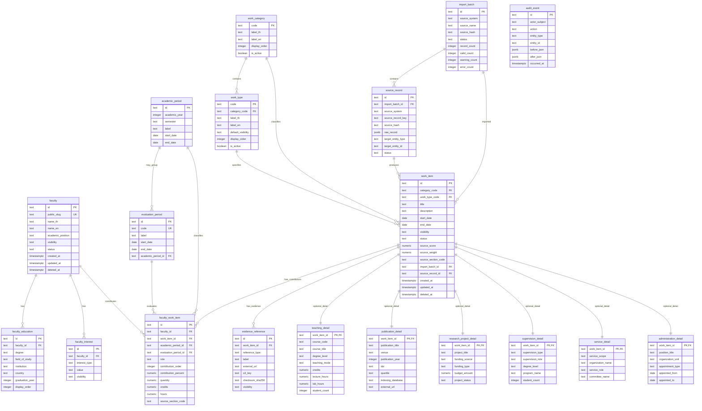

# V2 Repository ERD

เอกสารนี้เป็น ERD baseline สำหรับ Issue #47 - Design Relational Schema & SQL Migration

เป้าหมายของ ERD นี้คือทำให้ทีมเห็นความสัมพันธ์หลักของ V2 repository ก่อนเริ่มทำ API, import, migration และ UI โดยไม่ copy โครงสร้างแบบฟอร์มภาระงาน 1:1 เข้ามาเป็น schema

---

## ERD Overview

---

## Key Relationship Rules

- `work_item` เป็นแกนกลางของผลงานและภาระงานทุกประเภท
- subtype detail tables ใช้ `work_item_id` เป็นทั้ง primary key และ foreign key
- `faculty_work_item` รองรับ many-to-many ระหว่าง faculty กับ work item
- `academic_period` และ `evaluation_period` แยกกันเพื่อรองรับกรณีปีการศึกษาไม่ตรงกับปีปฏิทิน
- `work_category` และ `work_type` เป็น master data สำหรับ filter, API response และ UI dropdown
- `source_record` และ `import_batch` ทำให้ import ตรวจสอบย้อนกลับและทำ idempotency ได้
- `audit_event` เก็บ mutation history สำหรับ admin/import ไม่เปิดผ่าน public API

---

## Visibility Boundary

ตารางที่มี `visibility` โดยตรง:

- `faculty`
- `faculty_interest`
- `work_item`
- `work_type` ผ่าน `default_visibility`
- `evidence_reference`

Public API ต้องกรองข้อมูลที่ `visibility = 'PUBLIC'` และต้องไม่ expose `s3_key`, restricted evidence หรือ audit/import raw data โดยตรง

